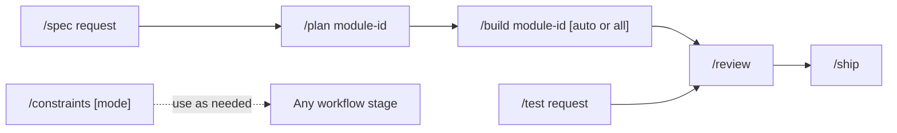

# Contributing to FlowSpace

Use the repository commands to move work from a request to a reviewed pull request. Choose the shortest workflow that covers the change.

## Command reference

| Command | Arguments | Purpose |
| --- | --- | --- |
| `/spec` | `<request>` | Define a product capability, its scope, and its acceptance criteria before implementation. |
| `/plan` | `<module-id>` | Split an approved specification into ordered GitHub Issues and a module plan. |
| `/build` | `[<module-id>] [auto\|all]` | Implement the next ready issue. Use `auto` or `all` to implement every approved issue in dependency order. |
| `/test` | `<request>` | Use test-driven development for a focused feature or bug fix outside the module workflow. |
| `/review` | None | Review the current changes for correctness, readability, architecture, security, and performance. |
| `/ship` | None | Run launch checks and produce a go or no-go decision with a rollback plan. |
| `/constraints` | `[check\|guard\|ratchet]` | Set up the quality rules, run them, detect a weaker quality bar, or update measured limits. |

## Command workflow

| Step | Command | When to use it | What it does |
| --- | --- | --- | --- |
| 1 | `/spec <request>` | Define a new product capability before implementation. Review and approve the specification before running `/plan`. | Uses `spec-driven-development` to clarify the request, scope, and acceptance criteria. Creates `docs/specs/<module-id>.md` and updates `docs/specs/README.md`. A request with several capabilities can also create `docs/specs/maps/<map-id>.md`. Does not change implementation code. |
| 2 | `/plan <module-id>` | Run after the specification is approved. Approve the plan before the command creates GitHub Issues. | Uses `planning-and-task-breakdown` to divide the module into small, ordered tasks. Creates `tasks/<module-id>.md` and uses `tasks/.todo.md` as temporary input. After approval, creates the GitHub Issues, adds them to the repository project, records dependencies, replaces the plan's task list with issue links, and deletes `tasks/.todo.md`. |
| 3 | `/build <module-id> [auto\|all]` | Implement the next ready issue. Omit `<module-id>` if `tasks/` contains one plan. Use `auto` or `all` only after the full plan is approved. Otherwise, run `/build` again after the maintainer merges the previous issue. | Uses `incremental-implementation` and `test-driven-development`, plus `debugging-and-error-recovery` if a step fails. For each issue, produces a failing test, the minimum implementation, verification results, and one tested commit. Changes the source and test files named by the issue, with no fixed file set. The pull request closes completed issues after the maintainer merges it. |
| 4 | `/test <request>` | Make a focused feature or bug fix that does not need a specification and module plan. | Uses `test-driven-development` to write a failing test, add the minimum implementation, and run regression tests. Changes the relevant source and test files without creating a fixed planning file. |
| 5 | `/review` | Run after implementation. Resolve all Critical and Important findings, then rerun the affected checks. | Uses `code-review-and-quality` for a five-axis review, plus `security-and-hardening` and `performance-optimization` for those parts. Returns findings with file and line references. Does not create a repository file. |
| 6 | `/ship` | Run after review findings are resolved. | Uses `shipping-and-launch`. Runs the `code-reviewer`, `security-auditor`, and `test-engineer` personas unless the change meets every skip condition. The skip conditions are at most two files, fewer than 50 changed lines, and no auth, payments, data access, configuration, or environment files. Returns a go or no-go decision, blockers, known risks, and a rollback plan. Does not create a repository file. A GO decision prepares the change for maintainer review. It does not merge the pull request. |
| 7 | `/constraints [check\|guard\|ratchet]` | Run without an argument to set up quality rules. Use `check` to run the current rules, `guard` to find weaker rules, or `ratchet` to record measured values as new minimum limits. | Uses `constraint-driven-development`. Creates or updates `CONSTRAINTS.md` and can add enforcement scripts or tool configuration. `check` and `guard` report results without changing the quality bar. `ratchet` updates the limits in `CONSTRAINTS.md`. |

## Pull request handoff

Keep one reviewable change on each branch and pull request. Run the required checks from `Taskfile.yaml`, inspect the complete diff, and record the exact results in the pull request template. The maintainer reviews and squash merges the pull request.

## Agents without command support

Some agents do not register repository commands as slash commands. Tell the agent to read the matching command file and give it the arguments from the command table. Write the rest of the prompt for your task.

| Command | Command file | Arguments |
| --- | --- | --- |
| `/spec` | `@.agents/commands/spec.md` | `<request>` |
| `/plan` | `@.agents/commands/plan.md` | `<module-id>` |
| `/build` | `@.agents/commands/build.md` | `[<module-id>] [auto\|all]` |
| `/test` | `@.agents/commands/test.md` | `<request>` |
| `/review` | `@.agents/commands/review.md` | None |
| `/ship` | `@.agents/commands/ship.md` | None |
| `/constraints` | `@.agents/commands/constraints.md` | `[check\|guard\|ratchet]` |
