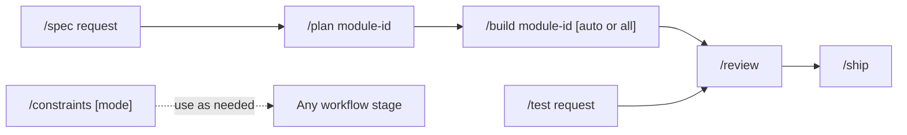

# Contributing to FlowSpace

Use the repository commands to move work from a request to a reviewed pull request. Choose the shortest workflow that covers the change.

## Command reference

| Command | Arguments | Purpose |
| --- | --- | --- |
| `/spec` | `<request>` | Define a product capability, its scope, and its acceptance criteria before implementation. |
| `/plan` | `<module-id>` | Split an approved specification into ordered GitHub Issues and a module plan. |
| `/build` | `[<module-id>] [auto\|all]` | Implement the next ready issue. Use `auto` or `all` to implement every approved issue in dependency order. |
| `/test` | `<request>` | Use test-driven development for a focused feature or bug fix outside the module workflow. |
| `/review` | None | Review the current changes for correctness, readability, architecture, security, and performance. |
| `/ship` | None | Run launch checks and produce a go or no-go decision with a rollback plan. |
| `/constraints` | `[check\|guard\|ratchet]` | Set up the quality rules, run them, detect a weaker quality bar, or update measured limits. |

## Command workflow

### 1. Define a capability with `/spec`

Use `/spec <request>` for a new product capability. The command uses the `spec-driven-development` skill to clarify the request, define the scope, and write acceptance criteria. It creates `docs/specs/<module-id>.md` and updates `docs/specs/README.md`. A request with several capabilities can also create `docs/specs/maps/<map-id>.md`.

Review and approve the specification before you run `/plan`. The command does not change implementation code.

### 2. Plan the module with `/plan`

Use `/plan <module-id>` after the specification is approved. The command uses the `planning-and-task-breakdown` skill to divide the module into small, ordered tasks. It creates `tasks/<module-id>.md` and uses `tasks/.todo.md` as temporary input for GitHub Issue creation.

After approval, the command creates the GitHub Issues, adds them to the repository project, and records their dependencies. It then replaces the task list in the plan with issue links and deletes `tasks/.todo.md`.

### 3. Implement issues with `/build`

Use `/build <module-id>` to implement the next ready issue. If `tasks/` contains one plan, you can omit `<module-id>`. Add `auto` or `all` only after the full plan is approved. Without either mode, run `/build` again after the maintainer merges the previous issue. The command uses the `incremental-implementation` and `test-driven-development` skills. It uses the `debugging-and-error-recovery` skill if a step fails.

Each issue produces a failing test, the minimum implementation, verification results, and one tested commit. The command changes the source and test files named by the issue. It does not create a fixed set of files. The pull request closes completed issues after the maintainer merges it.

### 4. Make a focused change with `/test`

Use `/test <request>` for a focused feature or bug fix that does not need a specification and module plan. The command uses the `test-driven-development` skill. It writes a failing test first, adds the minimum implementation, and runs regression tests.

The command changes the relevant source and test files. It does not create a fixed planning file.

### 5. Review the change with `/review`

Use `/review` after implementation. The command uses the `code-review-and-quality` skill for a five-axis review. It also uses the `security-and-hardening` and `performance-optimization` skills for those parts of the review.

The command returns findings with file and line references. It does not create a repository file. Resolve all Critical and Important findings, then run the affected checks again.

### 6. Make the launch decision with `/ship`

Use `/ship` after the review findings are resolved. The command uses the `shipping-and-launch` skill. It runs the `code-reviewer`, `security-auditor`, and `test-engineer` personas unless the change meets every skip condition. A skipped fan-out must touch at most two files, change fewer than 50 lines, and avoid auth, payments, data access, configuration, and environment files.

The command returns a go or no-go decision, blockers, known risks, and a rollback plan. It does not create a repository file. A GO decision prepares the change for maintainer review. It does not merge the pull request.

### 7. Manage the quality bar with `/constraints`

Use `/constraints` without an argument to set up the repository quality rules. The command uses the `constraint-driven-development` skill. It creates or updates `CONSTRAINTS.md` and can add the scripts or tool configuration that enforce the selected rules.

Use `/constraints check` to run the current rules. Use `/constraints guard` to find changes that weaken the rules. These two modes report results without changing the quality bar. Use `/constraints ratchet` to record current measured values as new minimum limits in `CONSTRAINTS.md`.

## Pull request handoff

Keep one reviewable change on each branch and pull request. Run the required checks from `Taskfile.yaml`, inspect the complete diff, and record the exact results in the pull request template. The maintainer reviews and squash merges the pull request.

## Agents without command support

Some agents do not register repository commands as slash commands. Tell the agent to read the matching command file and give it the arguments from the command table. Write the rest of the prompt for your task.

| Command | Command file | Arguments |
| --- | --- | --- |
| `/spec` | `@.agents/commands/spec.md` | `<request>` |
| `/plan` | `@.agents/commands/plan.md` | `<module-id>` |
| `/build` | `@.agents/commands/build.md` | `[<module-id>] [auto\|all]` |
| `/test` | `@.agents/commands/test.md` | `<request>` |
| `/review` | `@.agents/commands/review.md` | None |
| `/ship` | `@.agents/commands/ship.md` | None |
| `/constraints` | `@.agents/commands/constraints.md` | `[check\|guard\|ratchet]` |
