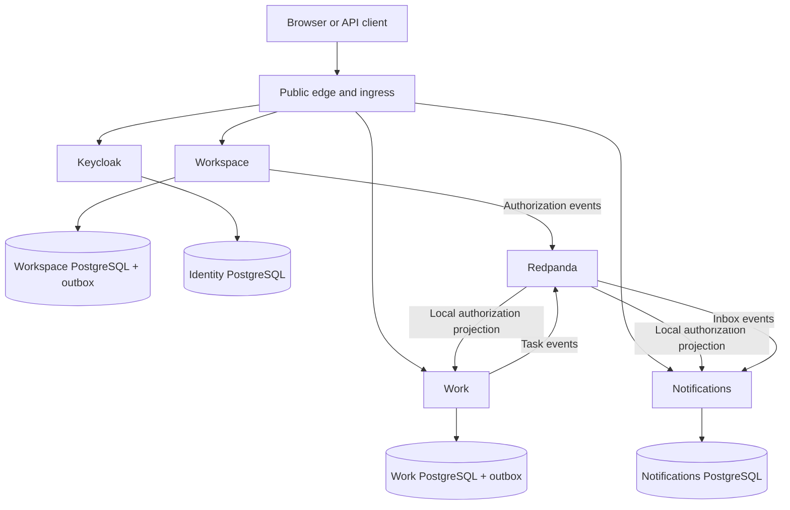
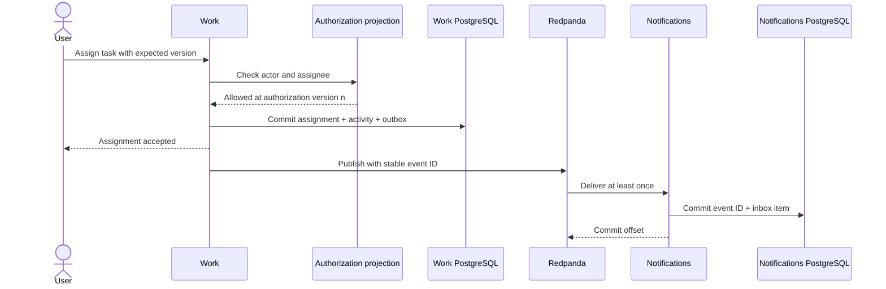

# FlowSpace architecture overview

Status: accepted direction with implementation proposals still open.

Updated: 2026-09-10.

This document defines product rules, service boundaries, cross-service behavior, and learning evidence. Accepted rationale lives in the [ADR index](adr/README.md); replaceable tools live in [technology choices](technology-choices.md).

## 1. Goal and constraints

Build a work-management platform to learn production-grade distributed-system design and failure handling.

- Initial product: workspaces, memberships, projects, tasks, comments, and in-app notifications.
- First milestone: backend only, exercised through API clients and automated smoke tests.
- Architecture: three independently deployable Go services in one repository and one root Go module.
- Infrastructure: local Kubernetes on Mac; staging and production-named environments share one Ubuntu host.
- Host budget: user-reported 32 GB RAM and 500 GB SSD. The GPU is outside the initial scope.
- Cost: hosted development services must remain within a zero-spend limit.
- Data: disposable until independent backups and tested restoration exist.

The single host is an accepted constraint, not high availability. “Production” is an environment name, not a production-readiness claim.

## 2. Product rules

### Workspaces and access

- One identity may belong to multiple workspaces with a different role in each.
- Every workspace member can view every project in that workspace.
- Each workspace has exactly one owner. Ownership transfer is atomic, and the owner cannot leave before transferring it.
- Invitations target an email address. Acceptance requires a signed-in identity with the matching verified email; the recipient need not have an account when invited.
- Memberships reference the stable identity subject, not the email address.

| Role | Permissions |
| --- | --- |
| Viewer | Read projects, tasks, and comments |
| Member | Viewer permissions plus create, edit, assign, and comment |
| Admin | Member permissions plus manage projects and member/viewer memberships |
| Owner | Admin permissions plus manage admins, transfer ownership, and archive the workspace |

Only owners may grant or modify administrator access.

### Tasks

- Statuses are To Do, In Progress, and Done.
- Authorized users may move between any statuses, including reopening Done tasks.
- A task has zero or one assignee.
- Every task content, status, and assignment update requires an expected version; stale writes return a conflict.

### Identity

- Keycloak owns authentication; FlowSpace owns workspace authorization.
- Initial login methods are local email/password and Google.
- Mailpit captures verification and password-reset email in learning environments.
- Branded authentication pages remain Keycloak-hosted themes.

## 3. Service boundaries

| Component | Owns | Depends on |
| --- | --- | --- |
| Identity | Credentials, login, tokens, account identity | No FlowSpace service |
| Workspace | Workspaces, memberships, invitations, roles, authorization events | Identity tokens |
| Work | Projects, tasks, assignments, comments, activity, outbox, authorization projection | Identity tokens and Workspace events |
| Notifications | Inbox, read state, deduplication, authorization projection | Identity tokens, Workspace events, and Work events |

Build order: Identity integration → Workspace → Work → Notifications.

Projects, tasks, assignments, and comments stay in Work so related rules share local transactions. Notifications is separate because notification failure must not undo a task write.

Each database box is a dedicated PostgreSQL instance per environment. All instances still share the physical host.

## 4. Data and consistency

### Ownership

- Each service owns its database, credentials, migrations, connection pool, storage, and recovery.
- Services communicate through contracts and never read another service's database.
- Cross-service identifiers are references, not foreign keys.
- Tenant-owned records carry a workspace identifier; local constraints prevent cross-workspace relationships.

### Authorization projections

Workspace publishes ordered membership and role changes plus periodic watermarks through its outbox. Work and Notifications apply the event, version, event ID, and checkpoint in one local transaction before committing the broker offset.

A projection is usable only when:

- the consumer is healthy;
- the latest watermark is within the configured staleness bound; and
- no authorization-version gap exists.

Otherwise, the service fails closed with a temporary error. Authorization is evaluated at request admission. An admitted request may finish during concurrent revocation; later requests are denied after the newer version reaches the projection.

### Event delivery

When a mutation emits an event, its state change and outbox record commit together. The publisher retries with the same event ID.

A successful assignment means Work committed the assignment and pending event; notification delivery may lag. Notifications enforces event-ID uniqueness, so redelivery does not create duplicate inbox items. This is at-least-once delivery with idempotent effects, not end-to-end exactly once.

Event, outbox, deduplication, schema, and backup retention must cover the supported replay window. Version gaps, poison records, backlog, lag, and replay require metrics and tests.

## 5. Interfaces and security

- Protobuf service definitions are the source of truth for synchronous APIs.
- Public methods expose generated REST/JSON routes; internal clients use typed gRPC calls.
- Event contracts are versioned separately from RPC contracts.
- Generated adapters contain no business rules.
- Services validate token signature, issuer, audience, and expiry.
- Client-supplied tenant IDs, object IDs, and role claims are never authorization evidence.
- Databases and broker clients use per-service credentials and broker ACLs.
- Kubernetes uses namespace RBAC, default-deny network policies, non-root containers, input limits, and ingress TLS.
- Only selected application routes are public. Cluster, database, broker, deployment, and identity administration remain private.
- Staging adds an edge access gate; production's user-facing API remains public with normal application authentication.
- Git contains encrypted secret manifests only. Plaintext and decryption keys stay outside Git and the host.

## 6. Environments and delivery

| Environment | Runtime | Data |
| --- | --- | --- |
| Local | k3d in Docker Desktop, orchestrated by Tilt | Disposable |
| Staging | K3s on Ubuntu, access-gated public hostname | Persistent but replaceable |
| Production-named | K3s on the same Ubuntu host, public application routes | Disposable until independent recovery exists |

- Kustomize defines application environment overlays; maintained Helm charts package third-party infrastructure.
- Argo CD reconciles staging and production from Git. CI does not receive direct cluster deployment access.
- Service images are public, versioned GHCR artifacts and contain no secrets.
- Each service runs migrations in a controlled, retry-safe job before code requiring the schema.
- Node-local volumes survive pod replacement but not disk or host loss.
- Namespaces, extra replicas, and separate database processes do not create independent host failure domains.

## 7. Observability and recovery

- Emit structured logs with service, environment, request ID, operation, outcome, and duration.
- Propagate trace context through synchronous calls and event headers.
- Track request rate, errors, latency, database-pool waits, outbox age, consumer lag, authorization-watermark age, poison records, disk, restarts, and backup age.
- Bound telemetry retention, buffering, sampling, and label cardinality. Telemetry failure must not block requests.
- Readiness, liveness, and startup checks have separate purposes; downstream failure must not cause unrelated restart loops.
- Drain requests and safely finish or abandon event work during shutdown.

Before real teams:

- add encrypted backup storage independent of the server;
- back up every service database, broker state, Schema Registry, identity data, configuration, and secret-controller keys;
- align event retention, offsets, deduplication history, and restored database state; and
- prove restoration and application invariants from the independent destination.

## 8. Learning evidence

| Increment | Working capability | Required evidence |
| --- | --- | --- |
| 1. Identity and Workspace | Login, recovery, workspaces, invitations, roles | Wrong-tenant and revoked-member access is rejected |
| 2. Work | Projects, tasks, assignment, status changes, comments | Invalid relationships fail; concurrent updates conflict |
| 3. Notifications | Assignment produces an inbox item | Crash and replay tests preserve eventual, duplicate-free delivery |
| 4. Operations | Staging, dashboards, promotion, backup | Diagnose failure and restore verified state |
| 5. Capacity | Multiple replicas and controlled load | Identify bottlenecks and explain the single-host limit |

Required failure experiments:

- broker unavailable: writes commit while outbox capacity remains, then publish after recovery;
- publisher or consumer crash: replay creates one inbox item;
- authorization stream stale or gapped: affected services fail closed;
- concurrent task updates: one succeeds and one conflicts;
- database unavailable: writes fail clearly and ambiguous retries are controlled;
- host restart and restore: measure outage, recovery time, and data loss.

## 9. Open proposals

Keep these here until accepted; then update the owning ADR.

- API conventions: pagination, error schema, deadlines, and HTTP idempotency keys.
- Edge details: hostnames, access allowlists, proxy headers, origin TLS, and administrative access.
- Runtime topology: exact namespace, replica, resource, and retention settings.
- Delivery gates: CI stages, image promotion, smoke-test location, and migration ordering.
- Observability: collection paths, storage modes, alert routing, retention, and sampling.
- Recovery: backup destination and tooling, schedule, and recovery objectives.
- Capacity: workload model and pass/fail thresholds.
- Frontend: technology, browser-session handling, and token storage.
- Product specifications: invitation lifecycle and assignment/notification triggers.
- Readiness: threat model, pinned versions, and implementation time budget.

## 10. Deferred

Not in the initial scope:

- private projects, nested teams, multiple assignees, and configurable workflows;
- real email delivery, LinkedIn login, and enterprise SSO;
- service mesh, custom API gateway, shared application cache, Elasticsearch, event sourcing, generic saga infrastructure, and custom Kubernetes operators;
- a service per entity or separate Go modules;
- multi-host availability and distributed storage; and
- AI features, which must later use authorized APIs rather than direct database access.
