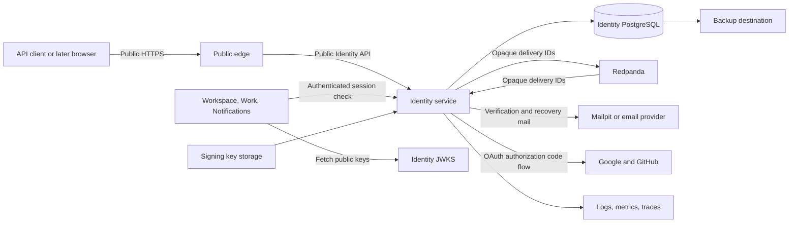

# Identity threat model

Status: Initial model for specification and implementation review.

Last reviewed: 2026-09-23.

## Purpose

This document models threats to the FlowSpace Identity service defined by [ADR-0031](../adr/0031-flowspace-owns-authentication-and-revocable-sessions.md). It turns security risks into controls and test evidence. Each Identity feature specification must reference the applicable threat IDs.

The model covers email and password accounts, six-digit email codes, Google and GitHub login, provider linking, access tokens, refresh tokens, logout, and internal session checks. It covers API clients first. A later browser release needs a separate review of token storage, cookies, cross-site request forgery, and browser code.

Workspace roles and resource authorization remain outside this model. Identity proves who the caller is and whether the session is active. Workspace and the other protected services decide what that subject can do.

## Deployment stages

The first release uses Mailpit and disposable data. It is a learning environment and must not hold data that users expect FlowSpace to preserve.

Before real users join, FlowSpace must use real email delivery, MFA, independent encrypted backups, and tested restoration. The unresolved risks and release gates in this document must also be closed or explicitly accepted.

## Security objectives

Identity must meet these objectives:

- Prevent one person from acting as another account.
- Keep passwords, email codes, provider credentials, refresh tokens, and private signing keys secret.
- Preserve the correct link between a stable FlowSpace subject, an email address, and each provider identity.
- Reject every new request from a session after logout commits.
- Prevent account discovery through response content, status, timing, or rate-limit behavior where the public contract does not require disclosure.
- Limit automated guessing, credential stuffing, email flooding, and resource exhaustion.
- Record security events without recording reusable secrets or unnecessary personal data.
- Keep personal data findable for retention, export, correction, and deletion work before real-user use.

## System and trust boundaries

| Boundary | Untrusted or sensitive input | Required treatment |
| --- | --- | --- |
| Internet client to public edge | Headers, JSON, credentials, tokens, email codes, provider callbacks | Use HTTPS, size limits, strict parsing, safe errors, and endpoint rate limits. |
| Edge to Identity | Forwarded identity, source address, host, scheme, and request ID | Trust only configured proxies. Reject conflicting or malformed forwarded values. |
| Identity to PostgreSQL | Account, session, challenge, and provider data | Use parameterized queries, transactions, database constraints, and least-privilege credentials. |
| Identity to email system | Email address, code, template data, and delivery status | Send the minimum data. Do not place codes in logs or telemetry. Treat delivery responses as untrusted. |
| Identity to Redpanda | Delivery event ID and challenge ID | Publish opaque identifiers only. Keep encrypted code material in Identity storage. Recheck the current challenge before mail delivery. |
| Identity to Google or GitHub | Authorization code, provider tokens, provider identity, and verified-email evidence | Use provider-specific validation. Bind each response to one login or link transaction. |
| Protected service to Identity | Access-token subject and session ID | Authenticate the calling service. Compare the subject and session with server-owned state. Fail closed. |
| Identity to protected services | JWKS and session status | Publish public keys only. Authenticate session-status responses and prevent caching that delays revocation. |
| Runtime to telemetry and backups | Security events, personal data, hashes, and encrypted secrets | Use field allowlists, access limits, retention rules, and encryption. Test deletion and restoration. |

## Assets

| Asset | Security need | Main failure |
| --- | --- | --- |
| Private signing keys | Confidentiality and integrity | An attacker can mint accepted access tokens. |
| Passwords during a request | Confidentiality | Logs, traces, errors, or memory dumps expose a password. |
| Password hashes and parameters | Confidentiality and integrity | Offline guessing or parameter downgrade weakens every password account. |
| Six-digit verification and reset codes | Confidentiality, integrity, and single use | Guessing or replay verifies or recovers the wrong account. |
| Refresh tokens and token hashes | Confidentiality, integrity, and single-use rotation | Theft or a race keeps an unauthorized session alive. |
| Session records | Integrity and availability | Revoked sessions appear active, or valid users lose access. |
| Email and provider links | Integrity | A provider identity or email address links to the wrong subject. |
| Provider client secrets and temporary tokens | Confidentiality | An attacker impersonates FlowSpace or a user at the provider. |
| Personal data | Confidentiality and controlled retention | Data leaks, remains longer than required, or cannot be deleted. |
| Security audit records | Integrity and controlled disclosure | Attack evidence disappears or logs expose credentials. |

## Threat actors and assumptions

The model considers an unauthenticated attacker, a malicious user, a credential-stuffing operator, a mailbox attacker, and a person with a stolen token. It also considers a compromised API client, service workload, dependency, email system, or provider response.

The public network, client, email delivery status, provider callback, and all request fields are untrusted. Cluster location alone does not make an internal call trusted.

A root compromise of the single host can expose application data, session state, and runtime secrets. Namespace isolation does not remove this risk. The project must record a separate key-storage and recovery decision before it treats the environment as suitable for preserved user data.

## Threats, controls, and evidence

STRIDE classifies threats as spoofing, tampering, repudiation, information disclosure, denial of service, or elevation of privilege.

| ID | Threat and STRIDE class | Required controls | Required evidence |
| --- | --- | --- | --- |
| ID-T01 | Account enumeration through signup, login, verification, or recovery responses. Information disclosure. | Use the same public result where disclosure is not required. Keep status, response shape, and practical timing consistent. Apply limits without revealing which account bucket exists. | API tests compare existing and missing accounts. Timing tests use a defined tolerance and enough samples to find a practical difference. |
| ID-T02 | Password guessing, spraying, or credential stuffing. Spoofing and denial of service. | Use independent account and source limits. Store passwords with an approved password hashing function and reviewed cost. Reject known-compromised passwords before real-user use. Do not use permanent lockout as the only control. | Tests prove that each limit works across source and account changes. Load tests prove that the limiter has one shared state when more than one replica serves traffic. |
| ID-T03 | Guessing or flooding six-digit verification and recovery codes. Spoofing and denial of service. | Bind each code to one subject, purpose, and destination. Store a keyed verifier and retain a separately encrypted code only while delivery can retry. Set a short expiry, attempt limit, resend limit, and issue limit. Invalidate the code after success and when its replacement becomes active. | Boundary tests cover expiry, wrong purpose, replay, replacement, attempt exhaustion, and concurrent submissions. Email tests prove that one caller cannot cause unbounded delivery or send a stale code. |
| ID-T04 | Theft or replay of a verification or reset code. Spoofing. | Never place codes in URLs, logs, metrics, traces, or support output. Accept a code once. Do not change credentials before proof succeeds. Notify the account after a password changes. | Secret scanning and telemetry tests find no code. A replay and two concurrent uses produce one effect. |
| ID-T05 | Account takeover through password recovery. Spoofing and elevation of privilege. | Return a generic recovery result. Bind recovery to the intended account. Invalidate all recovery challenges after success. Revoke existing sessions under the policy approved by the recovery specification. | Tests cover missing accounts, stale challenges, concurrent reset, session policy, and a lost response after commit. |
| ID-T06 | Provider callback CSRF, authorization-code injection, mix-up, or open redirect. Spoofing and tampering. | Use the authorization code flow with PKCE `S256` and a one-time `state` value for Google and GitHub. Bind both values to the client and provider. Use and validate a one-time `nonce` for Google. Match redirect URIs exactly, except for an approved loopback port. Disable wildcard callbacks and reject unapproved return locations. | Provider-adapter tests cover wrong provider, state, nonce, PKCE verifier, redirect URI, issuer, and reused transaction. |
| ID-T07 | A forged or incomplete provider response creates a session. Spoofing. | For Google, validate the ID token signature, issuer, audience, nonce, expiry, and subject. For GitHub, exchange the code on the server and fetch the stable user ID from the authenticated API. Validate verified-email evidence through the documented provider interface. | Contract tests use recorded safe fixtures for each provider and reject every missing or altered security field. Live smoke tests run only with disposable provider accounts. |
| ID-T08 | Email matching links a provider to another person's account. Elevation of privilege. | Never link accounts by matching email addresses. Use the provider name and stable provider subject as the unique external identity. Require an authenticated FlowSpace session and provider proof for linking. Handle link conflicts without moving ownership. | Tests prove that matching emails stay separate, one provider identity cannot link twice, and a conflict changes no link or session. |
| ID-T09 | A stolen access token is replayed. Spoofing. | Use short-lived signed access tokens over HTTPS. Never accept tokens in URLs. Validate token type, algorithm, signature, issuer, audience, expiry, subject, and session ID. Check live session state before every protected request. | Token tests change one header or claim at a time. Integration tests reject a valid token after logout commits. |
| ID-T10 | Algorithm confusion, key substitution, or stale key use makes a forged JWT valid. Spoofing and tampering. | Allow only the configured signing algorithm. Bind keys to the configured issuer. Do not load a key from a token-controlled URL. Select a known key ID and reject unknown keys. Keep old public keys only while accepted tokens can use them. | Tests cover `none`, another algorithm, an unknown key ID, a wrong issuer, a substituted JWKS, and key rotation across the maximum token lifetime. |
| ID-T11 | A stolen refresh token creates new access tokens. Spoofing. | Generate refresh tokens with a cryptographically secure source. Store only hashes. Rotate on each successful use. Treat reuse of an invalidated token as theft and revoke the affected session. | Database tests cover token secrecy, rotation, replay, two concurrent refreshes, transaction rollback, and reuse detection. |
| ID-T12 | A race during refresh, code use, account claim, or provider link creates duplicate effects. Tampering and elevation of privilege. | Use one transaction and conditional writes for each single-use transition. Add database uniqueness constraints for identities and active links. Return a safe result after a lost or concurrent response. | Concurrency tests start competing operations and prove that only one state transition commits. |
| ID-T13 | Logout reports success before revocation is durable. Spoofing. | Commit session revocation and refresh-token invalidation before success. A session check that starts after commit must reject the session. Requests already admitted can finish. | Integration tests pause around the commit and prove the accepted race boundary for one-device and all-device logout. |
| ID-T14 | A protected service skips or forges the live session check. Spoofing and elevation of privilege. | Authenticate each protected service to Identity. Match the token subject and session ID with Identity state. Do not cache a successful check. Deny admission when Identity cannot confirm the session. | Service tests cover a wrong service identity, mismatched subject, revoked session, unavailable Identity, timeout, and malformed response. |
| ID-T15 | A caller injects data or exploits ambiguous parsing. Tampering and elevation of privilege. | Use strict input limits and one canonical parser at each boundary. Use parameterized SQL. Reject duplicate security headers, malformed Unicode, unknown enum values, and unsupported content types. | Fuzz and boundary tests cover public inputs, token parsing, provider responses, and email fields. Static analysis reports no injection findings. |
| ID-T16 | Requests exhaust CPU, database connections, email delivery, or provider quotas. Denial of service. | Set body, concurrency, deadline, and endpoint rate limits. Put expensive password work behind cheap shape and limit checks. Bound outbound calls and retries. Keep rate-limit state shared across replicas. | Load tests cover login, code request, code submission, refresh, and session check. Failure tests cover slow email and provider dependencies. |
| ID-T17 | Logs, metrics, traces, errors, or analytics expose secrets or excess personal data. Information disclosure. | Use an allowlist of telemetry fields. Never record passwords, codes, access tokens, refresh tokens, authorization codes, provider tokens, or private keys. Minimize email and network identifiers. Use safe client errors. | Automated tests inspect captured telemetry and errors. Secret scanning runs on every change. Review defines retention for each personal field. |
| ID-T18 | A database, backup, or operator compromise exposes credentials and identity data. Information disclosure and tampering. | Use least-privilege credentials, encrypted transport, restricted backup access, and protected secret storage. Keep private signing keys outside the database. Record every privileged security action. | Restore tests prove data integrity. Access reviews cover database, backup, signing key, and audit-log permissions. |
| ID-T19 | Clock errors extend token or code validity or reject valid credentials. Spoofing and denial of service. | Use a trusted clock source. Enforce expiry on the server. Define one small clock tolerance for signed tokens. Do not extend code or session lifetime from client time. | Tests run before, at, and after every expiry boundary with allowed positive and negative clock skew. |
| ID-T20 | A compromised dependency or build step steals secrets or changes authentication. Tampering and elevation of privilege. | Pin dependencies and tools. Review new cryptography and provider packages. Keep install and generation reproducible. Run static analysis, secret scanning, and reachable vulnerability scanning. | CI records locked inputs and passes the repository security checks. Reviewers inspect dependency and lockfile changes with authentication code. |
| ID-T21 | Personal data remains after its purpose or cannot be exported, corrected, or deleted. Information disclosure and repudiation. | Give each stored personal field a purpose and retention rule. Keep subject-owned data findable. Define deletion effects for sessions, provider links, audit records, telemetry, and backups before real-user use. | Data-lifecycle tests trace one subject through export, correction, deletion, retention expiry, and backup restoration. |
| ID-T22 | A single-host compromise exposes Identity data and signing keys. Spoofing, tampering, and information disclosure. | Keep the learning environment limited to disposable data. Define protected key storage, emergency rotation, independent backups, and incident recovery before preserving user data. | A tabletop exercise covers key theft, token rejection, session revocation, restore, and user notification. The real-user gate records any accepted residual risk. |

## Cross-feature security invariants

Every Identity specification and implementation must preserve these rules:

- The stable subject does not change when an email address or provider link changes.
- A client never supplies trusted subject, session, verified-email, provider-link, or role state.
- A reusable secret never appears in a URL or telemetry event.
- A one-time credential causes no more than one committed effect.
- A security-sensitive state transition commits before the service reports success.
- A failure to confirm identity or session state denies access.
- Database constraints protect identity uniqueness even when requests run concurrently.
- Security responses reveal only the information required by the approved public contract.

## Required review and test evidence

Each feature specification must map its success criteria and abuse tests to the relevant threat IDs. Implementation review must include the public API, application rules, database transaction, outbound adapter, telemetry, and deployment configuration for that feature.

Before an Identity capability is complete, its tests must cover valid use, malformed input, replay, concurrency, dependency failure, and cancellation. Security tests must run through the public transport when response status, headers, timing, or request limits are part of the control.

Before real users join, FlowSpace must complete these exercises:

1. Rotate a signing key while old access tokens remain valid, then retire the old public key safely.
2. Steal a test refresh token, reuse it after rotation, and prove that Identity revokes the affected session.
3. Log out one device and all devices, then prove that later protected requests fail.
4. Guess verification and recovery codes under controlled load, then prove that attempt and delivery limits stop the attack.
5. Simulate email and provider outages, then prove that Identity does not create partial accounts, links, or sessions.
6. Restore Identity from an independent encrypted backup and prove account, link, challenge, and session invariants.
7. Simulate signing-key theft and execute the approved emergency rotation and incident procedure.

## Open security decisions

Feature specifications or later ADRs must resolve these items before implementation depends on them:

- Password hashing algorithm, parameters, maximum input size, and compromised-password source.
- Access-token lifetime, refresh-session lifetime, idle policy, clock tolerance, and refresh retry behavior.
- Signing algorithm, key storage, routine rotation, emergency rotation, and JWKS cache behavior.
- Code lifetime, attempt limit, resend interval, issue limit, and protected storage method.
- Rate-limit keys, thresholds, shared storage, trusted proxy rules, and safe client responses.
- Password-reset session revocation and notification behavior.
- Authentication method for internal session checks and JWKS retrieval policy.
- Provider scopes, redirect URIs, transaction storage, claim validation, verified-email evidence, and outage behavior.
- Email normalization, email change, provider unlink, account deletion, and subject-retirement rules.
- Browser token storage and cross-site request protections for the later web release.
- Personal-data purposes, retention periods, export, correction, deletion, and incident-notification duties.

## Residual risks and real-user gate

Six-digit email codes have limited entropy. Rate limits, short expiry, single use, and mailbox security reduce this risk but do not remove it. Email verification and password recovery do not provide phishing-resistant authentication.

Bearer access tokens work for any party that steals them until expiry or session revocation. Live session checks reduce the window after detected theft or logout. They also make Identity an availability dependency for protected requests.

The initial single-host environment has one administrative and physical failure domain. Backups improve recovery but do not prevent an active host compromise from stealing runtime secrets. The project must review this residual risk and the signing-key design before it preserves real-user data.

MFA is deferred from the first disposable-data release. The architecture requires MFA before real teams use FlowSpace. The MFA design needs a new threat-model review because enrollment and recovery add account-takeover paths.

## Sources

- [OWASP Application Security Verification Standard 5.0](https://owasp.org/projects/asvs/)
- [OWASP Authentication Cheat Sheet](https://cheatsheetseries.owasp.org/cheatsheets/Authentication_Cheat_Sheet.html)
- [OWASP Forgot Password Cheat Sheet](https://cheatsheetseries.owasp.org/cheatsheets/Forgot_Password_Cheat_Sheet.html)
- [OWASP Session Management Cheat Sheet](https://cheatsheetseries.owasp.org/cheatsheets/Session_Management_Cheat_Sheet.html)
- [OWASP Email Validation and Verification Cheat Sheet](https://cheatsheetseries.owasp.org/cheatsheets/Email_Validation_and_Verification_Cheat_Sheet.html)
- [OAuth 2.0 Security Best Current Practice, RFC 9700](https://www.rfc-editor.org/rfc/rfc9700.html)
- [JSON Web Token Best Current Practices, RFC 8725](https://www.rfc-editor.org/rfc/rfc8725.html)
- [NIST SP 800-63B-4, Authentication and Authenticator Management](https://pages.nist.gov/800-63-4/sp800-63b.html)
- [GitHub Docs, Authorizing OAuth apps](https://docs.github.com/en/apps/oauth-apps/building-oauth-apps/authorizing-oauth-apps)
- [Google OpenID Connect](https://developers.google.com/identity/openid-connect/openid-connect)
