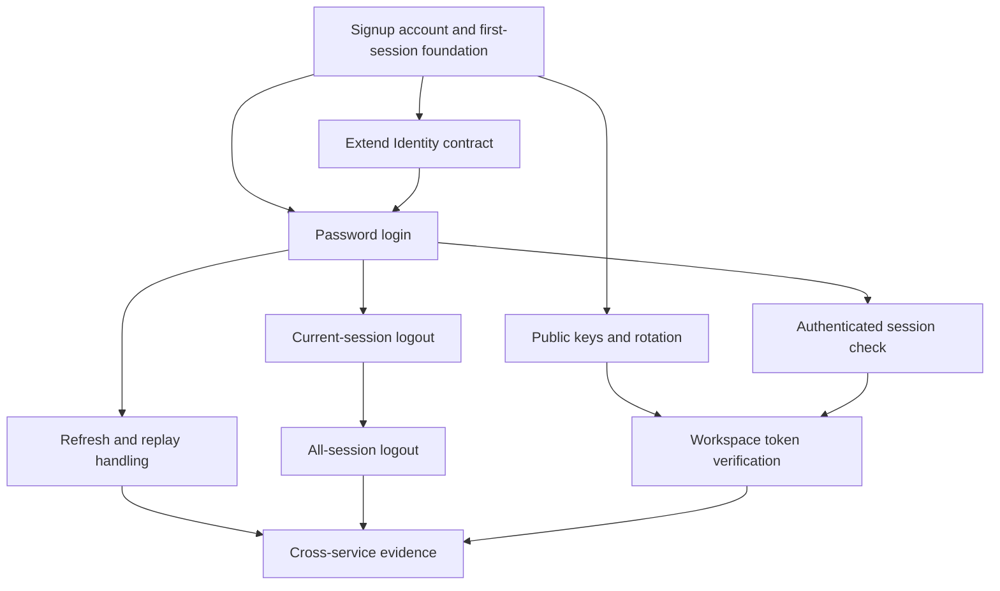

# Implementation plan: Identity password login and sessions

Module id: `identity-password-login-and-sessions`

Status: Draft.

## Overview

Add password login, refresh, logout, public signing keys, and a live session check to FlowSpace Identity. Then replace Workspace's Keycloak token check with FlowSpace token verification and a live session check. This plan follows the [approved specification](../docs/specs/identity-password-login-and-sessions.md), [Identity threat model](../docs/security/identity-threat-model.md), [ADR-0031](../docs/adr/0031-flowspace-owns-authentication-and-revocable-sessions.md), and the accepted [session security profile](../docs/adr/0035-identity-uses-a-bounded-session-security-profile.md). No capability map includes this module.

The [signup and email verification module](../docs/specs/identity-signup-and-email-verification.md) comes first. Its account, password hash, first-session code, and [Redpanda email outbox](../docs/adr/0036-identity-delivers-email-through-a-redpanda-outbox.md) form the input to this plan. Signup owns the initial session schema and token issuer; login extends them after signup merges. Inspect the merged signup code and issues before assigning overlapping work.

## Architecture decisions

- Identity owns account credentials, sessions, refresh-token hashes, signing keys, and its PostgreSQL data. Workspace owns membership and role decisions.
- Protobuf defines the RPC contract and public REST routes. `CheckSession` has no public HTTP route.
- Each protected request uses local access-token verification and a live, authenticated `CheckSession` call. A failed check denies admission.
- One transaction consumes a refresh token and stores its replacement hash. A known rotated token revokes its session.
- Logout commits revocation before success. All-session logout serializes with session creation for the same subject.
- Login and refresh reject `Idempotency-Key` under [ADR-0033](../docs/adr/0033-identity-token-issuance-does-not-replay-responses.md). A lost refresh response requires password login.
- Store service-owned code under `services/identity/`. Reuse concrete signup code before adding a shared package.

## Dependency graph

## Task list

The issue-ready task details and acceptance criteria are in [.todo.md](.todo.md). After plan approval, create one GitHub Issue per task, add each issue to the repository project with `Todo` status, record its blockers, replace this index with issue links, and delete `.todo.md`.

### Phase 1: Contract

- Task 1: Extend the Identity contract for password sessions.

### Checkpoint: Contract

- [ ] The contract uses the accepted signing, JWKS, internal authentication, and login-limit choices in ADR-0035.
- [ ] The signup module owns the initial account and session model, and the contract passes Buf lint, generation, and compatibility checks.

### Phase 2: Issue and renew sessions

- Task 2: Sign in with a password through the public API.
- Task 3: Publish and rotate public signing keys.
- Task 4: Refresh a session with single-use tokens.

### Checkpoint: Session issuance

- [ ] Login returns two distinct tokens for the stable subject, including when its email is unverified.
- [ ] Refresh preserves the 90-day absolute limit and revokes a session after known token reuse.
- [ ] Token and key tests cover invalid claims, unknown keys, expiry boundaries, lost responses, and concurrent refresh.

### Phase 3: Revoke and check sessions

- Task 5: Log out the current session.
- Task 6: Log out every session for the account.
- Task 7: Expose an authenticated internal session check.

### Checkpoint: Revocation

- [ ] Session checks started after logout commits reject the affected sessions.
- [ ] A new login after all-session logout creates an active session.
- [ ] An unverified account stays active in Identity while Workspace access remains blocked.

### Phase 4: Protected service and evidence

- Task 8: Replace Workspace's Keycloak check with FlowSpace session admission.
- Task 9: Prove the public and cross-service failure paths.

### Checkpoint: Complete

- [ ] Each success criterion in the approved specification has test or review evidence, including the linked threat IDs.
- [ ] Generated files match their sources, and the required repository checks pass.
- [ ] The full diff contains no unrelated change, secret, or unwanted build output and is ready for maintainer review.

## Risks and controls

| Risk | Effect | Control |
| --- | --- | --- |
| Signup and login implement different session rules. | A signup session can bypass the limits or fail to refresh. | Reuse the merged signup session model and test signup and claim sessions with the same expiry rules. |
| Two refresh calls consume one token. | A client can receive a token for a revoked session. | Use conditional writes in one transaction and test the committed winner and replay revocation. |
| Identity cannot answer a session check. | A protected service can admit a revoked session. | Fail closed and test timeout, outage, and malformed replies through Workspace. |
| A new key replaces an old key too early. | Valid access tokens fail before expiry. | Publish the new key before use and retain the old public key through the full accepted token lifetime and cache margin. |
| Limits differ across replicas or reveal account state. | An attacker can guess passwords or find accounts. | Use approved shared limit state and compare public errors and practical response timing for known and unknown accounts. |

## Approved decisions for the first experiment

- [ADR-0035](../docs/adr/0035-identity-uses-a-bounded-session-security-profile.md) fixes signing, key storage and rotation, JWKS, internal caller authentication, login limits, proxy trust, and ownership of the shared session model.
- [ADR-0036](../docs/adr/0036-identity-delivers-email-through-a-redpanda-outbox.md) fixes the signup prerequisite: Identity sends email through a PostgreSQL outbox, Redpanda, and its own SMTP consumer.

The single-host key-theft exercise and independent backup decision remain real-user gates in the [threat model](../docs/security/identity-threat-model.md). This plan does not claim real-user readiness.
