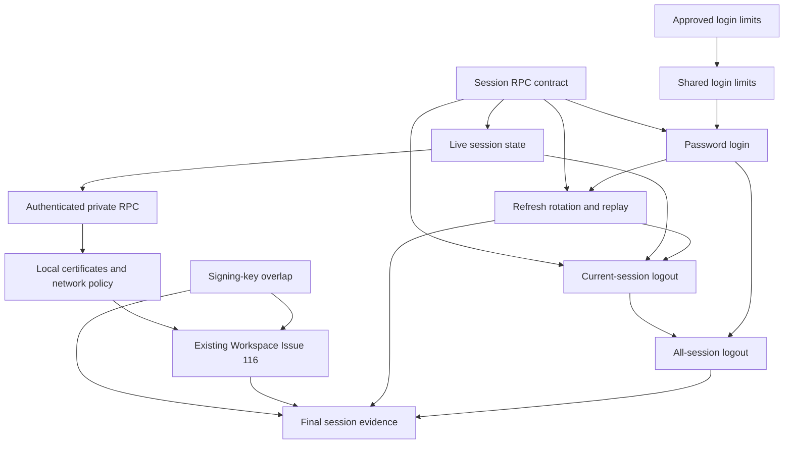

# Implementation plan: Identity password login and sessions

Module id: `identity-password-login-and-sessions`

Status: Approved.

## Overview

Add password login, refresh, logout, signing-key overlap, and live session checks to the existing Identity service. The [approved specification](../docs/specs/identity-password-login-and-sessions.md) defines the behavior. Signup and account claim already issue the first session and token pair; this plan extends that shared session lifecycle. The [flowspace-api GitHub Project](https://github.com/users/vasapolrittideah/projects/4) tracks the tasks.

## Architecture decisions

- Reuse Identity's existing Ed25519 signer, session issuance, account lookup, trusted source-address handling, PostgreSQL limit store, and JWKS route. [ADR-0035](../docs/adr/0035-identity-signup-security-and-mail-delivery.md) fixes token validation, the JWKS cache bound, and key rotation; these choices do not need another approval.
- The approved specification allows 60 password-login attempts per trusted source address in a rolling hour. It also allows 10 attempts per normalized email identifier in a rolling 15 minutes. Both limits count unknown accounts and successful logins. Identity rejects a full limit before hashing and fails closed when the shared limit store is unavailable.
- Keep the five session RPCs in `flowspace.identity.v1`. Only the four client operations get REST routes. `CheckSession` has no public REST route, and the public gRPC listener rejects a direct call.
- Read current account and session state in Identity for every `CheckSession`. The caller first validates the access token locally and passes its subject and session ID. Identity returns the current email-verification state, never a Workspace role.
- Serve `CheckSession` on a separate TLS 1.3 gRPC listener. Authenticate callers with the CA, URI subject alternative name, and public-key fingerprint allowlist in [ADR-0036](../docs/adr/0036-authenticate-internal-session-checks-with-mutual-tls.md). Keep health and JWKS on their existing listener.
- Keep only hashes of current and rotated refresh tokens. A transaction consumes the current token once; reuse of a known rotated token revokes that device session. Login, refresh, and logout use the same session expiry and revocation rules as signup and claim.
- Record login, refresh, replay, logout, session-check failure, and Identity-unavailable outcomes without credentials, tokens, full email addresses, or high-cardinality metric labels.
- Reuse [Issue #116](https://github.com/vasapolrittideah/flowspace-api/issues/116) for Workspace's local token validation, authenticated `CheckSession` client, and verified-email gate. This plan does not create a second Workspace admission task. [Issue #117](https://github.com/vasapolrittideah/flowspace-api/issues/117) remains the signup capability's final evidence task.

## Dependency graph

## Task list

Tasks are tracked in the [flowspace-api GitHub Project](https://github.com/users/vasapolrittideah/projects/4) under the [Identity password login and sessions milestone](https://github.com/vasapolrittideah/flowspace-api/milestone/2).

### Phase 1: Decisions and contract

- Task 1: [#155 Set numeric password-login limits](https://github.com/vasapolrittideah/flowspace-api/issues/155). [PR #167](https://github.com/vasapolrittideah/flowspace-api/pull/167) recorded the approved numbers. Issue #155 remains open until #161 and #162 finish.
- Task 2: [#156 Define public session and internal CheckSession contracts](https://github.com/vasapolrittideah/flowspace-api/issues/156)

### Checkpoint: Contract

- [x] The numeric limits are approved in the specification before login code depends on them.
- [ ] Buf accepts the public routes and the internal RPC, with no REST route for `CheckSession`.

### Phase 2: Live session checks

- Task 3: [#157 Return current Identity session state](https://github.com/vasapolrittideah/flowspace-api/issues/157)
- Task 4: [#158 Authenticate the private CheckSession RPC](https://github.com/vasapolrittideah/flowspace-api/issues/158)
- Task 5: [#159 Deploy the private Identity listener in the local cluster](https://github.com/vasapolrittideah/flowspace-api/issues/159)

### Checkpoint: Session admission

- [ ] Identity rejects a wrong subject, revoked or expired session, and retired account. A verified-email change appears on the next check.
- [ ] Missing or unapproved client certificates fail, and the public gRPC path rejects `CheckSession`.
- [ ] The local Service and NetworkPolicy expose the private listener only to approved callers. Issue #116 can use it without another Identity session-check path.

### Phase 3: Signing keys and password login

- Task 6: [#160 Publish signing keys through routine rotation](https://github.com/vasapolrittideah/flowspace-api/issues/160)
- Task 7: [#161 Enforce shared password-login limits](https://github.com/vasapolrittideah/flowspace-api/issues/161)
- Task 8: [#162 Create password sessions with generic failures](https://github.com/vasapolrittideah/flowspace-api/issues/162)

### Checkpoint: Login

- [ ] Old and new key IDs work during the approved overlap, and a retired key stops working after its last valid token expires.
- [ ] A known account receives one new session and token pair. Unknown, retired, and wrong-password requests have the same safe result.
- [ ] Source and email limits run before password hashing, and a limit-store outage denies login.

### Phase 4: Refresh and logout

- Task 9: [#163 Rotate refresh tokens and revoke on replay](https://github.com/vasapolrittideah/flowspace-api/issues/163)
- Task 10: [#164 Revoke the current session on logout](https://github.com/vasapolrittideah/flowspace-api/issues/164)
- Task 11: [#165 Revoke all sessions for a subject](https://github.com/vasapolrittideah/flowspace-api/issues/165)

### Checkpoint: Session lifecycle

- [ ] Concurrent refreshes cannot both succeed. Reusing a known old token revokes only its device session.
- [ ] Current-session logout stops later checks for that session, while another device stays active.
- [ ] All-session logout revokes sessions committed before it and permits a new login committed afterward.

### Phase 5: Completion evidence

- Task 12: [#166 Prove public, private, and failure paths](https://github.com/vasapolrittideah/flowspace-api/issues/166)

### Checkpoint: Complete

- [ ] Public REST and typed RPC tests cover every applicable specification success criterion and threat ID.
- [ ] Workspace Issue #116 proves local access-token validation, the live check, verified-email admission, and fail-closed behavior. The signup capability keeps its own final evidence in Issue #117.
- [ ] Generated output matches source contracts and queries. Required repository checks pass without weaker settings, and the review diff contains no unrelated changes or secrets.

## Risks and controls

| Risk | Impact | Control |
| --- | --- | --- |
| A protected service accepts a signed but revoked token. | Logout cannot stop new requests. | Require local token validation followed by an uncached, successful `CheckSession` on every protected request; prove the Workspace path in Issue #116. |
| A public caller reaches `CheckSession` or a private caller presents another service's certificate. | The caller can probe account and session state. | Keep the public gRPC method disabled; verify TLS client identity, URI SAN, and pinned public-key fingerprint on the private listener. |
| Two refresh requests consume the same token. | A replay stays active or two token pairs become valid. | Serialize the token transition in PostgreSQL and revoke the device when the loser presents a known rotated hash. |
| All-session logout races with session creation. | An old session remains active after logout success. | Serialize both operations on the account row and test both commit orders. |
| A key disappears before its last access token expires. | Valid requests fail during routine rotation. | Publish the next public key before switching the signer; retain the old key for the ADR-0035 overlap and test its retirement. |
| Identity or the limit store is unavailable. | Protected requests or login may bypass checks. | Return service unavailability without admitting the request or skipping a limit. |
