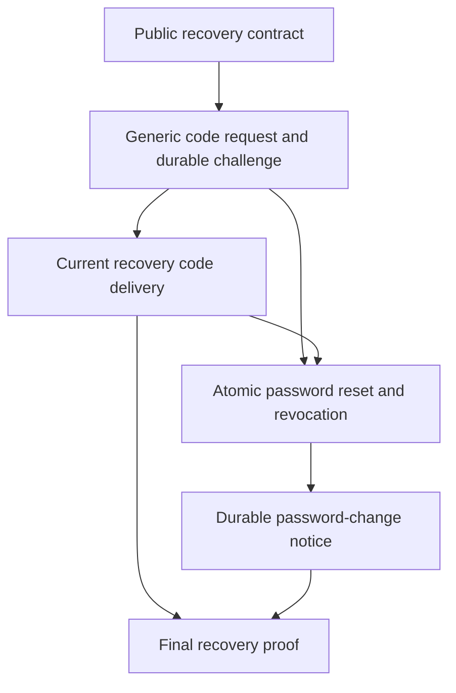

# Implementation plan: Identity password recovery

Module id: `identity-password-recovery`

Status: Approved.

## Overview

Add a public recovery-code request and a password reset for an existing verified password account. The [approved specification](../docs/specs/identity-password-recovery.md) defines eligibility, limits, atomic revocation, delivery, and failure behavior. The first clients use API requests and disposable data.

## Architecture decisions

- Add two unauthenticated RPCs to `flowspace.identity.v1` with generated REST routes. A code request always gives the same accepted response for valid email input, regardless of account eligibility. A reset gives no tokens and requires a later password login.
- Reuse Identity's email comparison, password policy, six-digit challenge verifier, encrypted delivery material, outbox, trusted source address, and PostgreSQL limit store. Add a password-reset purpose so verification and claim codes cannot reset a password.
- Keep the request, resend interval, and guess limits in shared PostgreSQL state across replicas. Count missing and ineligible accounts with a keyed email identifier and comparable public timing. Deny requests when the limit store is unavailable.
- Lock the account in the reset transaction so an old-password login or refresh cannot commit a new session after reset. Consume the challenge, replace the hash, revoke every session and refresh token, and queue a password-change notice before reporting success.
- Reuse the Identity outbox and email worker for recovery code delivery. Send only a current code, retry delivery failures, and keep passwords, codes, and full email addresses out of broker records and telemetry. Send the post-reset notice without including a password or code.
- Keep Workspace's existing live session check. The final verification must prove that every pre-reset session fails after commit and that a new password login succeeds.

## Dependency graph

## Task list

Tasks are tracked in the [flowspace-api GitHub Project](https://github.com/users/vasapolrittideah/projects/4) under the [Identity password recovery milestone](https://github.com/vasapolrittideah/flowspace-api/milestone/4).

### Phase 1: Contract and code request

- Task 1: [Define the public password recovery contract](https://github.com/vasapolrittideah/flowspace-api/issues/208).
- Task 2: [Request a recovery code with a generic response and durable challenge](https://github.com/vasapolrittideah/flowspace-api/issues/209).
- Task 3: [Deliver only the current recovery code through Mailpit](https://github.com/vasapolrittideah/flowspace-api/issues/210).

### Checkpoint: Recovery code

- [ ] Buf accepts both public routes and generated output matches the source contract.
- [ ] An eligible account receives one current code while a missing, unverified, or provider-only account gets the same accepted response without mail.
- [ ] The 60-second interval, shared source and account limits, stale-delivery rejection, and durable retry behavior pass focused tests.

### Phase 2: Password change

- Task 4: [Reset the password and revoke every existing session atomically](https://github.com/vasapolrittideah/flowspace-api/issues/211).
- Task 5: [Deliver a durable password-change notice](https://github.com/vasapolrittideah/flowspace-api/issues/212).

### Checkpoint: Reset

- [ ] One current code changes the password once and ends all prior sessions and refresh tokens without changing the subject, verified email, or provider links.
- [ ] An old-password login cannot commit after reset, a new-password login can create a fresh session, and the notice survives a mail outage.

### Phase 3: Completion checks

- Task 6: [Prove Identity password recovery against its specification](https://github.com/vasapolrittideah/flowspace-api/issues/213).

### Checkpoint: Complete

- [ ] Public REST, typed RPC, PostgreSQL, Mailpit, concurrency, failure, and cross-service tests cover the specification and applicable threat IDs.
- [ ] The final Issue result comment records results, gaps, and the review PR. Required repository checks pass without weaker settings.

## Risks and controls

| Risk | Impact | Control |
| --- | --- | --- |
| Response timing or rate limits reveal whether an account can recover. | An attacker can discover accounts or credentials. | Use one public response for valid email input, a keyed email limit bucket, shared source limits, comparable verifier work, and timing tests. |
| A code crosses purposes, is replayed, or arrives after replacement. | An attacker can change a password without current proof. | Bind the verifier to the subject, current email, and reset purpose; consume it once; check that queued delivery still names the current challenge. |
| Reset races with login or refresh. | An old credential creates a valid session after reset. | Lock the same account row in each transition and test both commit orders with concurrent requests. |
| A delivery or database failure leaves partial state. | A code or notice is lost, or a password changes without revocation. | Commit the challenge or password transition with its outbox record; retry delivery after commit and roll back all state if the durable write fails. |
| Secrets reach logs, broker records, or email notices. | Credentials or recovery codes can be reused. | Keep code material encrypted until delivery, publish opaque identifiers, and test telemetry and email contents. |
