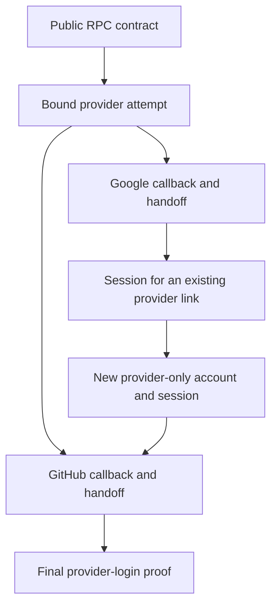

# Implementation plan: Identity provider login

Module id: `identity-provider-login`

Status: Approved.

## Overview

Add Google and GitHub login for API clients using the one-time browser handoff in the [approved specification](../docs/specs/identity-provider-login.md). Identity creates a session for a known provider link or creates a provider-only account when a new provider identity has an unused verified email. The first release uses disposable data.

## Architecture decisions

- Add `StartProviderLogin` and `CreateProviderSession` to `flowspace.identity.v1` with generated REST routes. Keep the provider callback as the small HTTP adapter approved by [ADR-0034](../docs/adr/0034-provider-login-uses-a-one-time-handoff.md). The callback never issues FlowSpace tokens.
- Store each short-lived attempt and its provider result in Identity PostgreSQL. Bind the provider, state, PKCE verifier, Google nonce, attempt token, and handoff code to one attempt. Store keyed verifiers for the two client proofs and consume each transition once.
- Verify Google ID tokens and GitHub user identity through separate provider adapters. Use the provider name and stable provider subject as the link key. Do not identify a returning user or link a password account by email alone.
- Extend Identity's account schema to allow a provider-only account without a password hash. Add a unique provider-link record. Reuse the existing session, email-challenge, outbox, trusted source-address, and shared limit paths.
- Keep collision and missing-email responses alike. Issue a session to a new unverified account, but keep Workspace's verified-email gate until FlowSpace verifies that email. Apply the existing session lifetimes to provider sessions.

## Dependency graph

## Task list

Tasks are tracked in the [flowspace-api GitHub Project](https://github.com/users/vasapolrittideah/projects/4) under the [Identity provider login milestone](https://github.com/vasapolrittideah/flowspace-api/milestone/5).

### Phase 1: Contract and browser handoff

- Task 1: [Define the public provider-login contract](https://github.com/vasapolrittideah/flowspace-api/issues/215).
- Task 2: [Start a bound provider attempt with shared limits](https://github.com/vasapolrittideah/flowspace-api/issues/216).
- Task 3: [Validate a Google callback and issue a one-time handoff code](https://github.com/vasapolrittideah/flowspace-api/issues/217).

### Checkpoint: Handoff

- [x] Both RPC routes and the Google callback route match the approved contract, and generated output matches the source Protobuf.
- [x] Google callback tests reject altered or replayed proof and show one handoff code without a FlowSpace token.
- [x] Attempt expiry, start and callback limits, safe errors, and secret-free callback content pass focused tests.

### Phase 2: Provider sessions and accounts

- Task 4: [Create a session for an existing provider link](https://github.com/vasapolrittideah/flowspace-api/issues/218).
- Task 5: [Create a provider-only account and session from an unused Google email](https://github.com/vasapolrittideah/flowspace-api/issues/219).

### Checkpoint: Google login

- [ ] A linked Google identity returns to the same subject even when its provider email changes or is absent.
- [ ] A new Google identity creates one account, link, and session; Gmail and Google Workspace email rules set the correct FlowSpace verification state.
- [ ] A new account with a verified third-party Google email receives a FlowSpace verification code, and Workspace denies access until that code is used.
- [ ] Email collisions, missing proof, concurrent claims, and lost responses leave no duplicate account or replayed token.

### Phase 3: GitHub login and completion checks

- Task 6: [Complete provider login with GitHub identity and email proof](https://github.com/vasapolrittideah/flowspace-api/issues/220).
- Task 7: [Prove Identity provider login against its specification](https://github.com/vasapolrittideah/flowspace-api/issues/221).

### Checkpoint: Complete

- [ ] Google and GitHub REST, callback, PostgreSQL, Mailpit, concurrency, failure, limit, telemetry, and cross-service tests cover the specification and applicable threat IDs.
- [ ] The final Issue result comment records results, gaps, and the review PR. Required repository checks pass without weaker settings.

## Risks and controls

| Risk | Impact | Control |
| --- | --- | --- |
| A forged, mixed, or replayed callback claims another login attempt. | An attacker gains a FlowSpace session. | Bind state, provider, PKCE, nonce, attempt token, and handoff code to one expiring attempt; test wrong and concurrent submissions. |
| An email match links a provider to a password account. | An attacker takes over another subject. | Use a unique provider subject link and reject an unlinked identity when its email belongs to an existing account. |
| Provider claims or email responses are incomplete or forged. | Identity creates a session for the wrong person. | Verify Google signatures and claims; fetch GitHub's authenticated user ID and primary verified email for a new identity. |
| A provider-only account bypasses email verification. | An unverified user reaches Workspace. | Apply the approved Google email rules and reuse the FlowSpace challenge and live session gate. |
| A database, provider, or email delivery failure leaves partial state. | An account, link, or session exists without the required proof or delivery record. | Commit account, link, session, and any email challenge with its outbox record together; retry delivery only after commit. |
| Secrets appear in callbacks, redirects, or telemetry. | A token or code can be reused. | Keep provider tokens server-side, render only the handoff code on the callback page, and capture browser output and telemetry in tests. |
