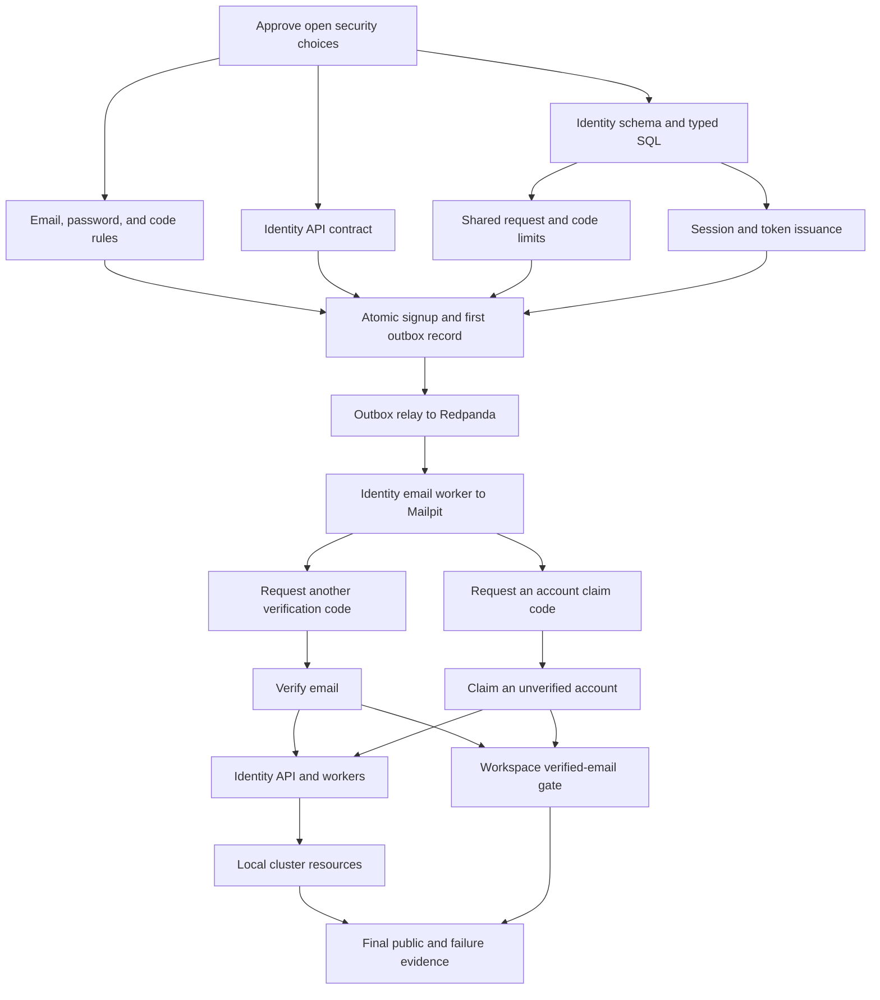

# Implementation plan: Identity signup and email verification

Module id: `identity-signup-and-email-verification`

Status: Draft.

## Overview

Build account signup, email verification, and recovery of an unverified address through an account claim. The [approved specification](../docs/specs/identity-signup-and-email-verification.md) defines this flow. Signup returns one session and token pair after a database commit. The account, first challenge, and email outbox record commit together. An Identity worker sends the email after an outbox relay publishes a delivery request through Redpanda. Broker or Mailpit failure delays delivery without changing a committed signup result.

The first clients use disposable data. Password login, refresh, logout, provider login, password reset, and real email delivery belong to other capabilities. Tasks will be tracked in the [flowspace-api GitHub Project](https://github.com/users/vasapolrittideah/projects/4) after review.

## Architecture decisions

- The `flowspace.identity.v1` Protobuf contract owns the five public RPCs and generated REST routes. Generated files contain no business rules.
- Identity owns account, session, challenge, limit, and outbox data in its PostgreSQL instance. A database uniqueness constraint enforces the approved email comparison rule under concurrent signup and claim requests.
- The account subject is stable and separate from the email address. Only a validated access token identifies the account for resend and verification.
- Password rules, Argon2id parameters, code limits, and session lifetimes come from the approved Identity specifications. Task 1 records the still open signing, key, source-address, blocklist, and queued-code protection choices before code depends on them.
- The signup transaction stores the unverified account, one session, one purpose-bound challenge, and one outbox record. It stores only a keyed verifier for code checks. Encrypted delivery material stays in Identity storage until delivery or expiry; the Redpanda event carries opaque identifiers, not an email address or code.
- The relay republishes an outbox record with the same event ID until Redpanda confirms it. The Identity email worker checks that the challenge is still current before sending to Mailpit, records its outcome, then commits the broker offset. A crash after Mailpit accepts a message can resend the same code; the system does not promise exactly one email.
- Resend and claim-code requests use the same durable delivery path. Replacing a challenge invalidates only the previous code for that purpose, and a stale delivery request cannot send an old code.
- Shared PostgreSQL limit state enforces the approved per-source and per-account limits across Identity replicas. The request handler uses only a trusted proxy source address.
- Workspace keeps its own membership rules. Its admission path asks Identity for the live session and verified-email state before it checks membership. This work must coordinate with the separate password-session capability.

## Dependency graph

## Task list

### Phase 1: Decisions and foundations

- [ ] Task 1: Approve the remaining signup security choices
- [ ] Task 2: Define the public Identity contract
- [ ] Task 3: Implement email, password, and code rules
- [ ] Task 4: Add Identity schema and typed queries

### Checkpoint: Foundations

- [ ] A human approves the security choices and the outbox treatment of code material.
- [ ] Buf accepts the public contract and generated output, and sqlc generates from the Identity schema.
- [ ] Domain tests cover the approved email, password, and code boundaries without infrastructure.

### Phase 2: Durable signup and asynchronous email

- [ ] Task 5: Enforce shared signup and code limits
- [ ] Task 6: Issue the first device session and tokens
- [ ] Task 7: Commit signup and its first delivery request
- [ ] Task 8: Publish Identity outbox requests to Redpanda
- [ ] Task 9: Deliver current codes through Mailpit

### Checkpoint: Signup and delivery

- [ ] A valid signup returns one unverified subject and one token pair after its database transaction commits.
- [ ] Broker and Mailpit outages leave a retryable delivery request and do not turn a committed signup into a failed response.
- [ ] Broker records, logs, and traces contain no email code, password, token, or full email address.

### Phase 3: Verification and account claim

- [ ] Task 10: Request another verification code
- [ ] Task 11: Verify the authenticated email address
- [ ] Task 12: Request an unverified-account claim code
- [ ] Task 13: Claim an unverified account

### Checkpoint: Account state

- [ ] One current code succeeds once, with the approved expiry and guess limits, even under concurrent requests.
- [ ] Claim and verification races produce one valid account state; a successful claim retires the old subject and sessions.
- [ ] Missing and ineligible claim-code requests return the same accepted response without an email.

### Phase 4: Runtime and completion evidence

- [ ] Task 14: Start the Identity API and workers
- [ ] Task 15: Deploy Identity in the local cluster
- [ ] Task 16: Run Redpanda and Mailpit in the local cluster
- [ ] Task 17: Deny Workspace access until email verification
- [ ] Task 18: Prove the complete public and failure paths

### Checkpoint: Complete

- [ ] Public REST and typed RPC tests cover every success criterion and applicable threat ID in the specification.
- [ ] Generated files match source contracts and queries. Required repository checks pass without weaker settings.
- [ ] The review diff contains no unrelated changes or secrets, and the module is ready for maintainer review.

## Risks and controls

| Risk | Impact | Control |
| --- | --- | --- |
| Redpanda or Mailpit is unavailable after signup commits. | The first email arrives late. | Keep the delivery request in the same transaction as signup, retry publication and delivery, and prove recovery in integration tests. |
| A broker replay or worker crash sends a message twice. | The user can receive duplicate mail. | Keep one valid challenge per purpose, use a stable event ID, and send the same current code on a delivery retry. Do not claim exactly one email. |
| A replaced or expired challenge still has a queued event. | The user can receive a stale code. | The worker checks current purpose, challenge ID, and expiry before sending; it discards stale work and removes delivery material. |
| Stored delivery material or broker records disclose a code. | An attacker can verify or claim an account. | Approve key storage, encryption, retention, and cleanup first. Put only opaque identifiers on Redpanda and test telemetry for secrets. |
| Verification races with claim or concurrent code use. | Two subjects or state transitions can become valid. | Serialize the affected account in PostgreSQL and test competing transactions. |
| The password-session capability changes shared session code. | Signup and Workspace admission can drift. | Reuse its approved session contract and coordinate one implementation of token issuance and live session checks. |
