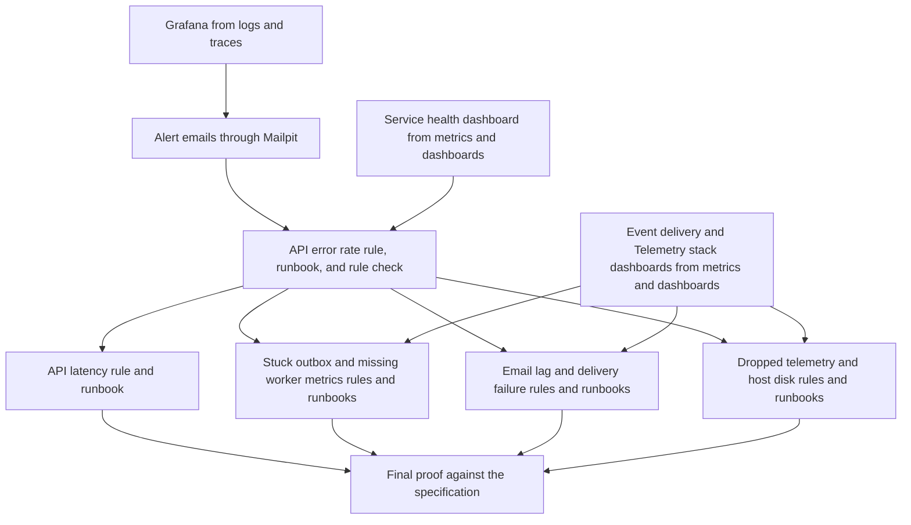

# Implementation plan: Observability alerts and runbooks

Module ID: `observability-alerts-and-runbooks`

Status: Approved

## Overview

Tell developers who run Flowspace in the `local` cluster when users or event delivery feel a failure, and tell them what to do next. Grafana evaluates eight alert rules against Prometheus and sends each notification as an email to Mailpit. Each rule links to one runbook in `docs/runbooks/`.

The plan follows the [Observability alerts and runbooks](../docs/specs/observability-alerts-and-runbooks.md) specification. This module depends on [Observability metrics and dashboards](observability-metrics-and-dashboards.md), because the rules read its metrics and the runbooks start from its dashboards. It also uses the Grafana that [Observability logs and traces](observability-logs-and-traces.md) adds. Each task that needs that work is blocked by the Issue that delivers it.

## Architecture decisions

- Git holds the rule group, the contact point, the notification policy, and the notification templates as Grafana provisioning files in JSON in `deploy/overlays/local/observability/alerting/`. Kustomize puts them in a ConfigMap, and the Grafana chart mounts it in the alerting provisioning folder, as [ADR-0039](../docs/adr/0039-local-alerts-run-in-grafana-and-notify-through-mailpit.md) decides. JSON lets a Node check read the files without a new dependency.
- One file holds the one rule group, which Grafana evaluates every minute. Each rule task adds its rules to that file in the order of the specification.
- The rules query the Prometheus data source by a fixed UID that its provisioning file sets. A rule state is normal when its query returns no data, and error when Grafana cannot query Prometheus.
- Grafana sends email through Mailpit on port 1025 without authentication or TLS. The sender and the recipient are both `alerts@flowspace.local`, so no other address appears in a notification.
- The existing `mailpit` NetworkPolicy in `deploy/overlays/local/identity/mail-infra-network-policy.yaml` gets one more source, the Grafana pod. No other policy opens Mailpit.
- A Node script, `scripts/check-alert-rules.mjs`, checks each rule against the contract of the specification. It makes sure that each `runbook_url` names a file in `docs/runbooks/`. A `node --test` file tests the script. CI runs both in the `Lint Markdown` job, because a runbook change can break the check.
- Each rule task triggers its symptom in the `local` cluster, records the alert email, and runs the first query of its runbook before the PR merges.
- The tunnel and the `staging` and `production` overlays do not change.

## Dependency graph

## Task list

Tasks are tracked in the [flowspace-api GitHub Project](https://github.com/users/vasapolrittideah/projects/4) under the [Observability alerts and runbooks milestone](https://github.com/vasapolrittideah/flowspace-api/milestone/8).

### Phase 1: Notification path

- Task 1: [#350 Send Grafana alert notifications to Mailpit](https://github.com/vasapolrittideah/flowspace-api/issues/350)
- Task 2: [#351 Alert when the API error rate is high](https://github.com/vasapolrittideah/flowspace-api/issues/351)

### Checkpoint: Notification path

- [ ] A test notification and a firing and resolved `API error rate is high` alert reach Mailpit with the subject and body of the specification.
- [ ] The rule check passes, and its tests show that it rejects a rule without a runbook or with a severity, label, or annotation outside the contract.
- [ ] A pod other than Grafana or `identity-worker` cannot connect to Mailpit port 1025.
- [ ] A human reviews the SMTP settings, the notification policy, the Mailpit NetworkPolicy, and the first runbook.

### Phase 2: Symptom rules

- Task 3: [#352 Alert when API latency is high](https://github.com/vasapolrittideah/flowspace-api/issues/352)
- Task 4: [#353 Alert when outbox events are stuck or worker metrics are missing](https://github.com/vasapolrittideah/flowspace-api/issues/353)
- Task 5: [#354 Alert when the email consumer lag does not decrease or email delivery fails](https://github.com/vasapolrittideah/flowspace-api/issues/354)
- Task 6: [#355 Alert when telemetry is dropped or the host disk is almost full](https://github.com/vasapolrittideah/flowspace-api/issues/355)

### Checkpoint: Symptom rules

- [ ] Each of the eight rules fired in the `local` cluster for its symptom, and its alert email reached Mailpit.
- [ ] `Worker metrics are missing` fires while `identity-worker` is stopped, and `Outbox events are stuck` and `Email consumer lag is not decreasing` stay normal.
- [ ] Each runbook follows the runbook conventions, and its first query ran in the `local` cluster.
- [ ] A human reviews each rule against the thresholds, pending periods, and severities of the specification.

### Phase 3: Completion checks

- Task 7: [#356 Prove observability alerts and runbooks against its specification](https://github.com/vasapolrittideah/flowspace-api/issues/356)

### Checkpoint: Complete

- [ ] Every success criterion in the approved specification passed its final check.
- [ ] The full review diff contains no unrelated changes or secrets.
- [ ] The module is ready for maintainer review.

## Risks and controls

| Risk | Impact | Control |
| --- | --- | --- |
| A rule fires while the cluster is idle and healthy. | Developers learn to ignore alert emails. | Require a minimum request rate in the API rules, set no data to normal, and run the 30-minute idle check in the final proof. |
| A rule does not fire when its symptom exists. | A real failure goes unnoticed. | Each rule task triggers its symptom in the `local` cluster and records the alert email in its PR. |
| A notification contains an ID, an email address, a raw path, or error text. | Personal data or secrets reach Mailpit. | Print only the summary, the allowed labels, and the two links in the templates. The rule check rejects other labels and annotations, and the final proof reads each alert email. |
| The kubelet reports no volume metrics for local-path volumes. | `Host disk is almost full` never fires. | Task 6 uses the volume metrics that [#341](https://github.com/vasapolrittideah/flowspace-api/issues/341) proves. If [#341](https://github.com/vasapolrittideah/flowspace-api/issues/341) changes the source, stop and ask the maintainer, because the specification needs a change. |
| A fault that a task injects stays in the cluster, such as a test NetworkPolicy or a stopped broker. | Later checks and tasks fail for an unrelated reason. | Each verification step that injects a fault also removes it and makes sure that the related alert resolves. |
| Rule tasks change the same rule file in parallel, or [#350](https://github.com/vasapolrittideah/flowspace-api/issues/350) and [#351](https://github.com/vasapolrittideah/flowspace-api/issues/351) change the Grafana values and the Kustomize file while metrics tasks [#340](https://github.com/vasapolrittideah/flowspace-api/issues/340), [#346](https://github.com/vasapolrittideah/flowspace-api/issues/346), or [#347](https://github.com/vasapolrittideah/flowspace-api/issues/347) change them. | Merge conflicts or lost rules and settings. | Keep the rules in the order of the specification, merge `main` before each PR, and let the rule check count the rules that exist. |
| Opening Mailpit to Grafana also opens it to other pods. | Any pod can send email through Mailpit. | Select only the Grafana pod in the policy, and test the connection from another pod. |
