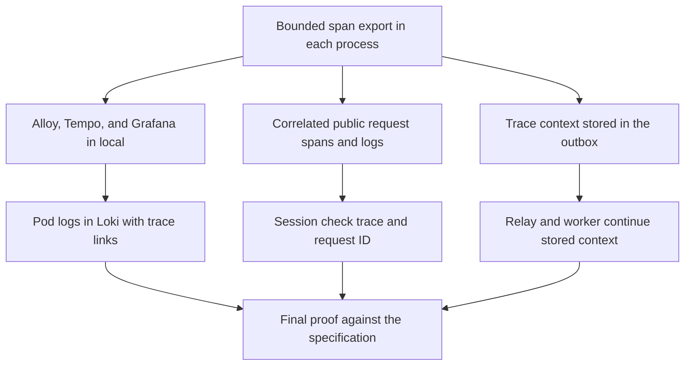

# Implementation plan: Observability logs and traces

Module id: `observability-logs-and-traces`

Status: Approved.

## Overview

Send the logs and traces of `identity-api`, `identity-worker`, and `workspace-api` to Loki and Tempo in the `local` cluster, and show them together in Grafana. A developer starts from a request ID or a trace ID and follows one request through Workspace, the Identity session check, the outbox relay, and the email worker.

The plan follows [the approved specification](../docs/specs/observability-logs-and-traces.md). No capability map includes this module. The [metrics and dashboards specification](../docs/specs/observability-metrics-and-dashboards.md) depends on this module, so this module comes first.

## Architecture decisions

- One shared package, `internal/tracing/`, sets up tracing for all three processes. It replaces `services/identity/internal/bootstrap/tracing.go`, so Workspace and Identity use the same exporter, sampler, queue, and shutdown rules. The package adds `tracing` to the commit scopes.
- The SDK reads the standard `OTEL_*` variables for the endpoint and the sampler. Code sets only the values that [ADR-0037](../docs/adr/0037-local-logs-and-traces-use-disposable-single-host-stores.md) fixes: a batch queue of 2048 spans, a 10-second export limit, and the resource attributes from the `service` and `environment` log values.
- The only new Go dependencies are the OTLP gRPC trace exporter and, where they fit, the OpenTelemetry gRPC instrumentation. Any other dependency needs approval first.
- The shared `logging` package gets the helper that writes `trace_id`. The module adds no second logger or request ID helper.
- Each service keeps its own HTTP middleware. The middleware owns the one server span of each public request and names it with a bounded operation name.
- The outbox stores `traceparent` and `tracestate` in two nullable columns that a new migration adds. The repository reads the context from the transaction context, so the use cases do not change.
- Alloy, Loki, Tempo, and Grafana run in the `flowspace-local` namespace from pinned upstream Helm charts. Tilt applies them like Keycloak, Redpanda, and Mailpit. Their values files, network policies, and the Grafana Sealed Secret live in `deploy/overlays/local/observability/`.
- Each chart turns off parts that the specification does not name, such as the Loki gateway, canary, caches, and object storage.
- Flowspace application pods get the label `app.kubernetes.io/part-of: flowspace`. Alloy selects pod logs with it, and the network policies allow the Alloy OTLP port only for it.
- The tunnel and the `staging` and `production` overlays do not change.

## Dependency graph

## Task list

Tasks are tracked in the [flowspace-api GitHub Project](https://github.com/users/vasapolrittideah/projects/4) under the [Observability logs and traces milestone](https://github.com/vasapolrittideah/flowspace-api/milestone/6).

### Phase 1: Export and storage

- Task 1: [#299 Export bounded spans from every Flowspace process](https://github.com/vasapolrittideah/flowspace-api/issues/299)
- Task 2: [#300 Store and view traces in local Tempo and Grafana](https://github.com/vasapolrittideah/flowspace-api/issues/300)
- Task 3: [#301 Collect pod logs in Loki and link them to traces](https://github.com/vasapolrittideah/flowspace-api/issues/301)

### Checkpoint: Export and storage

- [ ] Unit tests show that each process starts, serves, and stops on time without an endpoint and with an unreachable endpoint.
- [ ] Tilt brings up Alloy, Loki, Tempo, and Grafana with limits, and Grafana opens only through `kubectl port-forward`.
- [ ] An Identity request appears in Tempo, and its log lines appear in Loki with only the `service`, `environment`, and `namespace` labels.
- [ ] The plan records the measured CPU and memory use of each telemetry component after the first full run.
- [ ] A human reviews the chart choices, the turned-off chart parts, and the network policies.

### Phase 2: Correlation

- Task 4: [#302 Correlate public request spans and logs in Identity and Workspace](https://github.com/vasapolrittideah/flowspace-api/issues/302)
- Task 5: [#303 Trace the Workspace session check into Identity](https://github.com/vasapolrittideah/flowspace-api/issues/303)
- Task 6: [#304 Store trace context with each Identity outbox event](https://github.com/vasapolrittideah/flowspace-api/issues/304)
- Task 7: [#305 Continue stored trace context through the relay and the email worker](https://github.com/vasapolrittideah/flowspace-api/issues/305)

### Checkpoint: Correlation

- [ ] Unit tests pass for span names, attributes, error status, parent context, and the `request_id`, `trace_id`, `operation`, `outcome`, `status`, and `duration` fields.
- [ ] Docker integration tests show one trace from the outbox insert to email delivery.
- [ ] No unit test finds a token, password, code, or email address in a log line or span.
- [ ] A human reviews the migration, its rollback, and the propagated metadata.

### Phase 3: Completion checks

- Task 8: [#306 Prove observability logs and traces against its specification](https://github.com/vasapolrittideah/flowspace-api/issues/306)

### Checkpoint: Complete

- [ ] Every success criterion in the approved specification passed its final check.
- [ ] The full review diff contains no unrelated changes or secrets.
- [ ] The module is ready for maintainer review.

## Risks and controls

| Risk | Impact | Control |
| --- | --- | --- |
| Span export blocks a request or startup when Alloy is down. | Requests slow down or processes fail to start. | Use the batch processor, a lazy gRPC connection, and a 10-second export limit. Test with no endpoint, an unreachable endpoint, and a stopped Alloy. |
| A Helm chart starts components that the specification does not name. | The stack uses more memory and adds unreviewed parts. | Turn off extra parts in values files, list the rendered workloads in review, and ask before keeping any extra part. |
| A Loki label takes request IDs, trace IDs, or paths. | Loki memory and index size grow without a bound. | Set only the three labels in Alloy and list label values in the final cluster check. |
| A span or log line records a token, code, password, or email address. | Secrets and personal data reach disposable but shared storage. | Record only bounded names and listed attributes. Send known secret values in tests and search stored data for them. |
| The outbox migration breaks a running relay. | Verification and reset emails stop. | Add only nullable columns, read them only in new code, and test rollback with a Docker integration test. |
| The session check drops its trace or request ID across mutual TLS. | Criterion 3 fails and slow requests cannot be explained. | Test both sides with unit tests and check one real trace in the cluster. |
| The telemetry stack exhausts Docker Desktop resources. | The local cluster becomes slow or evicts pods. | Set requests and limits for each component and record measured use in this plan. |
