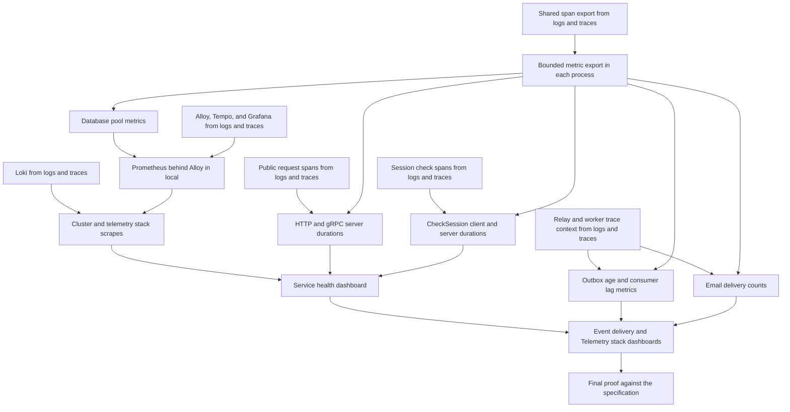

# Implementation plan: Observability metrics and dashboards

Module ID: `observability-metrics-and-dashboards`

Status: Approved

## Overview

Send metrics from `identity-api`, `identity-worker`, and `workspace-api` through Alloy to one Prometheus replica in the `local` cluster, and show them in three Grafana dashboards. A developer sees which service returns errors or answers slowly, whether emails wait in the outbox or the broker, and whether the telemetry stack is near full or drops data.

The plan follows [the approved specification](../docs/specs/observability-metrics-and-dashboards.md). This module depends on [Observability logs and traces](observability-logs-and-traces.md), because it uses the OTLP exporter configuration, the request middleware, Alloy, and Grafana that the logs and traces tasks add. Each task that needs that work is blocked by the Issue that delivers it.

## Architecture decisions

- One new shared package, `internal/metrics/`, sets up the meter provider for all three processes. It uses the OTLP gRPC metric exporter, a periodic reader that exports every 30 seconds with a 10-second limit, and the resource that `internal/tracing/` builds. It also sets the latency bucket bounds of the specification for every histogram in seconds. The package adds `metrics` to the commit scopes, as [ADR-0038](../docs/adr/0038-local-metrics-reach-a-single-host-prometheus-through-alloy.md) decides.
- The only new Go dependencies are `go.opentelemetry.io/otel/sdk/metric` and the OTLP gRPC metric exporter. Any other dependency needs approval first.
- The shared `postgrespool` package owns the four database pool instruments, because it owns the pool. One callback reads `pgxpool.Stat` at each export.
- The request middleware that the logs and traces tasks change records each HTTP and gRPC server duration with the same route, method, and status values as its server span. The services do not add `otelhttp` or `otelgrpc` metrics, so each request has one recorded duration and one source of label values.
- The Identity worker reads the outbox age and the consumer lag in observable gauge callbacks, with a 5-second limit for each measurement. The callbacks replace the `identity_outbox_age` and `identity_broker_lag` info lines and keep the two `unavailable` warning lines.
- Prometheus and kube-state-metrics run in the `flowspace-local` namespace from pinned upstream Helm charts of the `prometheus-community` repository. Tilt applies them with the other telemetry components. Their values files, network policies, and the Alloy RBAC change live in `deploy/overlays/local/observability/`.
- The Prometheus chart runs only the server. Its values turn off Alertmanager, the Pushgateway, the node exporter, the bundled kube-state-metrics, and every scrape job, because Alloy does all collection.
- Alloy scrapes these exact metric names, and the dashboards query them. The task that adds the scrapes makes sure that each name exists in the pinned chart versions, and it corrects this list if a name differs.

| Signal | Metric names |
| --- | --- |
| Container restart count | `kube_pod_container_status_restarts_total` |
| Used and total bytes of each volume | `kubelet_volume_stats_used_bytes`, `kubelet_volume_stats_capacity_bytes` |
| Spans and metric points that Alloy refuses or fails to send | `otelcol_receiver_refused_spans_ratio_total`, `otelcol_receiver_refused_metric_points_ratio_total`, `otelcol_exporter_send_failed_spans_ratio_total`, `prometheus_remote_storage_samples_failed_total` |
| Log entries that Alloy drops or fails to send | `loki_write_dropped_entries_total` |
| Storage size of the Prometheus database | `prometheus_tsdb_storage_blocks_bytes`, `prometheus_tsdb_head_chunks_storage_size_bytes`, `prometheus_tsdb_wal_storage_size_bytes` |
| Ingestion failures of Loki, Tempo, and Prometheus | `loki_discarded_samples_total`, `tempo_discarded_spans_total`, `prometheus_http_requests_total` for the `/api/v1/write` handler with a status other than 2xx |

- Git holds the dashboards as JSON files in `deploy/overlays/local/observability/dashboards/`. Kustomize puts them in a ConfigMap, and the Grafana chart loads that ConfigMap into the `Flowspace` folder.
- The tunnel and the `staging` and `production` overlays do not change.

## Dependency graph

## Task list

Tasks are tracked in the [flowspace-api GitHub Project](https://github.com/users/vasapolrittideah/projects/4) under the [Observability metrics and dashboards milestone](https://github.com/vasapolrittideah/flowspace-api/milestone/7).

### Phase 1: Export and storage

- Task 1: [#338 Export bounded metrics from every Flowspace process](https://github.com/vasapolrittideah/flowspace-api/issues/338)
- Task 2: [#339 Report database pool metrics from every Flowspace process](https://github.com/vasapolrittideah/flowspace-api/issues/339)
- Task 3: [#340 Store service metrics in a local Prometheus through Alloy](https://github.com/vasapolrittideah/flowspace-api/issues/340)
- Task 4: [#341 Scrape restart, volume, and telemetry stack metrics into Prometheus](https://github.com/vasapolrittideah/flowspace-api/issues/341)

### Checkpoint: Export and storage

- [ ] Unit tests show that each process starts, serves, and stops on time with metric export, without an endpoint and with an unreachable endpoint.
- [ ] Unit tests pass for the names, units, attributes, and values of the database pool metrics.
- [ ] Tilt brings up Prometheus and kube-state-metrics with limits, and Prometheus has one replica, a bound 5Gi volume, and a retention of 7 days and 4GB.
- [ ] Prometheus has series from all three processes, and its only kube-state-metrics series are container restarts in the Flowspace namespace.
- [ ] The plan records the measured CPU and memory use of Prometheus and kube-state-metrics after the first full run.
- [ ] A human reviews the chart choices, the turned-off chart parts, the Alloy RBAC change, and the network policies.

### Phase 2: Service metrics

- Task 5: [#342 Record HTTP and gRPC server durations in Identity and Workspace](https://github.com/vasapolrittideah/flowspace-api/issues/342)
- Task 6: [#343 Measure the session check on the Workspace and Identity sides](https://github.com/vasapolrittideah/flowspace-api/issues/343)
- Task 7: [#344 Report the outbox age and the consumer lag as metrics](https://github.com/vasapolrittideah/flowspace-api/issues/344)
- Task 8: [#345 Count email deliveries by kind and outcome](https://github.com/vasapolrittideah/flowspace-api/issues/345)

### Checkpoint: Service metrics

- [ ] Unit tests pass for the HTTP and gRPC duration labels, the `unmatched`, `_OTHER`, and `unknown` values, the session check durations, and the delivery kinds and outcomes.
- [ ] A Docker integration test shows the outbox age for unpublished, published, and absent events.
- [ ] No unit test finds an ID, an email address, a raw path, or error text in a metric attribute.
- [ ] A human reviews the removed log lines and the removed `identity.session_checks` counter.

### Phase 3: Dashboards

- Task 9: [#346 Show service health in a Grafana dashboard from Git](https://github.com/vasapolrittideah/flowspace-api/issues/346)
- Task 10: [#347 Show event delivery and telemetry stack health in Grafana dashboards from Git](https://github.com/vasapolrittideah/flowspace-api/issues/347)

### Checkpoint: Dashboards

- [ ] Grafana lists the Service health, Event delivery, and Telemetry stack dashboards from Git in the `Flowspace` folder.
- [ ] Each panel shows data for traffic that exists in the `local` cluster.
- [ ] A human reviews the panel queries and the dashboard JSON files.

### Phase 4: Completion checks

- Task 11: [#348 Prove observability metrics and dashboards against its specification](https://github.com/vasapolrittideah/flowspace-api/issues/348)

### Checkpoint: Complete

- [ ] Every success criterion in the approved specification passed its final check.
- [ ] The full review diff contains no unrelated changes or secrets.
- [ ] The module is ready for maintainer review.

## Risks and controls

| Risk | Impact | Control |
| --- | --- | --- |
| Metric export blocks a request or startup when Alloy is down. | Requests slow down or processes fail to start. | Use a periodic reader with a 10-second export limit. Test with no endpoint, an unreachable endpoint, and a stopped Alloy. |
| A metric label takes an unbounded value, such as a raw path or an ID. | Prometheus memory and disk use grow without a bound, and personal data reaches storage. | Record only route templates, `unmatched`, `_OTHER`, and `unknown`. Send IDs and raw paths in unit tests, and list the label values in the final cluster check. |
| The kubelet reports no volume metrics for `local` volumes, because the local-path provisioner creates hostPath volumes by default. | The Host filesystem use panel shows no data, and success criterion 10 fails. | Task 4 makes sure that the kubelet reports the Prometheus volume. If it does not, the task tries the `volumeType: local` annotation of the provisioner. If the kubelet still reports nothing, stop and ask the maintainer, because the specification and ADR-0038 need a change. |
| A Helm chart starts components that the specification does not name. | The stack uses more memory and adds unreviewed parts. | Turn off extra parts in values files, list the rendered workloads in review, and ask before keeping any extra part. |
| kube-state-metrics writes other families or namespaces. | Prometheus stores series that nobody reads, and the allowlist in the specification fails. | Limit the namespace and the metric family in kube-state-metrics, drop other families in Alloy, and list the series in the final cluster check. |
| An outbox age or lag measurement hangs. | The worker export runs late, or a dashboard shows a stale value. | Stop each measurement after 5 seconds, omit the value for that interval, and test a blocked measurement in a unit test. |
| A scraped metric name differs in the pinned component version. | A dashboard panel shows no data. | Task 4 queries each name in Prometheus, and the final proof checks that each panel shows data. |
| A task changes a file before the logs and traces task for that file merges. | Merge conflicts or lost trace changes. | Each task is blocked by the logs and traces Issue that changes the same files. |
| The telemetry stack exhausts Docker Desktop resources. | The local cluster becomes slow or evicts pods. | Set requests and limits for each component and record measured use in this plan. |
