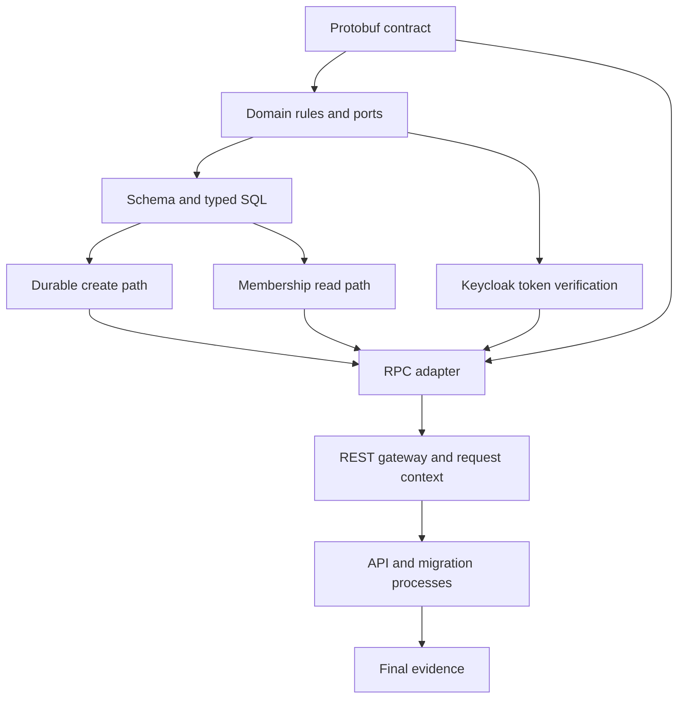

# Implementation plan: Workspace creation and reading

Module id: `workspace-create-read`

Planning baseline: Treat this module as unimplemented. Existing capability files do not count as completion evidence. Every task starts unchecked.

Completion record: [PR #79](https://github.com/vasapolrittideah/flowspace-api/pull/79) recorded final verification for the Keycloak-based module. [ADR-0031](../docs/adr/0031-flowspace-owns-authentication-and-revocable-sessions.md) later changed the identity direction. Replacing Keycloak is a separate change.

## Overview

Build `CreateWorkspace` and `GetWorkspace` for authenticated users. Creation stores one owner and supports safe retries for 24 hours. Reading requires Workspace-owned membership data.

The plan follows [the approved specification](../docs/specs/workspace-create-read.md). No capability map includes this module.

Tasks are tracked in the [flowspace-api GitHub Project](https://github.com/users/vasapolrittideah/projects/4).

## Architecture decisions

- Protobuf remains the source for RPC and REST. Generated files contain no business rules.
- Domain and application code remain independent of generated messages, PostgreSQL, and Keycloak.
- Workspace owns its schema, migrations, SQL, and PostgreSQL connection pool.
- The validated token subject identifies the actor. Membership data authorizes each read.
- One PostgreSQL transaction stores the workspace, owner membership, and completed retry record.
- A transaction-scoped advisory lock rejects overlapping requests and releases after connection loss.
- The create-specific retry table gives the method scope. It avoids a generic idempotency framework.
- Shared configuration and logging packages remain in use. The module adds no generic helper package.
- OpenTelemetry context propagation uses the installed libraries. Collector deployment remains outside this module.

## Dependency graph

## Task list

### Phase 1: Contract and foundations

- Task 1: [#45 Define the public Workspace contract](https://github.com/vasapolrittideah/flowspace-api/issues/45)
- Task 2: [#46 Model Workspace rules and application boundaries](https://github.com/vasapolrittideah/flowspace-api/issues/46)
- Task 3: [#47 Add the Workspace schema and typed queries](https://github.com/vasapolrittideah/flowspace-api/issues/47)

### Checkpoint: Foundations

- [x] Buf accepts the contract and its generated output.
- [x] Domain tests pass without infrastructure.
- [x] sqlc generates code from the migration and queries.
- [x] A human approves the contract, transaction model, and task order.

### Phase 2: Core application paths

- Task 4: [#48 Validate and coordinate workspace creation](https://github.com/vasapolrittideah/flowspace-api/issues/48)
- Task 5: [#49 Persist workspaces with durable retry protection](https://github.com/vasapolrittideah/flowspace-api/issues/49)
- Task 6: [#50 Read workspaces through membership data](https://github.com/vasapolrittideah/flowspace-api/issues/50)

### Checkpoint: Core application paths

- [x] Unit tests pass for creation, retries, validation, and reads.
- [x] PostgreSQL tests pass for atomic writes, concurrency, expiry, rollback, and role-based reads.
- [x] A human reviews the database invariants and safe retry behavior.

### Phase 3: Identity and public API

- Task 7: [#51 Verify Keycloak access tokens](https://github.com/vasapolrittideah/flowspace-api/issues/51)
- Task 8: [#52 Expose RPC behavior and canonical errors](https://github.com/vasapolrittideah/flowspace-api/issues/52)
- Task 9: [#53 Add REST limits, headers, request IDs, and trace context](https://github.com/vasapolrittideah/flowspace-api/issues/53)
- Task 10: [#54 Wire and run the Workspace API](https://github.com/vasapolrittideah/flowspace-api/issues/54)
- Task 11: [#55 Add the migration process and service image](https://github.com/vasapolrittideah/flowspace-api/issues/55)

### Checkpoint: Public flows

- [x] REST and RPC creation return the same resource and status behavior.
- [x] REST and RPC reads enforce the same membership rules.
- [x] Invalid input stops before application effects occur.
- [x] Deadlines, cancellation, request IDs, logs, and trace context cross the public boundary.

### Phase 4: Completion evidence

- Task 12: [#56 Run the complete module and repository checks](https://github.com/vasapolrittideah/flowspace-api/issues/56)

### Checkpoint: Complete

- [x] Every success criterion in the approved specification has recorded evidence.
- [x] Generated files match their source contracts and queries.
- [x] The full review diff contains no unrelated changes or secrets.
- [x] The module is ready for maintainer review.

## Risks and controls

| Risk | Impact | Control |
| --- | --- | --- |
| Two creates use the same subject and key at the same time. | Duplicate workspaces can persist. | Use a transaction-scoped advisory lock and a real PostgreSQL concurrency test. |
| A retry arrives after its record expires but before cleanup. | An old result can replay or block a new operation. | Treat `expires_at` as logical state and replace expired records inside the locked transaction. |
| A timeout occurs after the transaction commits. | The caller cannot know the result. | Return the stored result when the caller retries with the same key and normalized request. |
| REST and RPC reject requests differently. | Clients observe different contracts. | Use generated routes, canonical gRPC errors, and boundary tests for both transports. |
| The internal discovery address differs from the public issuer. | Valid Keycloak tokens can fail issuer checks. | Configure discovery and issuer separately while the verifier keeps the public issuer check. |
| Telemetry export fails or grows without a bound. | Diagnostics can delay requests or consume service resources. | Propagate context without blocking requests. Keep exporters and storage outside this module. |
